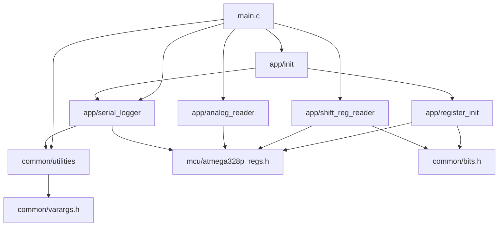
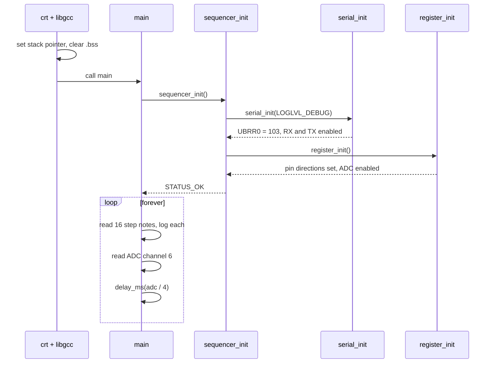

# nano_sequencer — architecture and inner workings

An analysis of the firmware as it stands on `dev` at `316e431`. It covers how the code is layered, what happens from reset to the main loop, how each module works at the register level, and a list of findings (bugs, inconsistencies, and things that will matter when the output stage is added).

How this was checked: every source file was read, and the firmware was compiled with the Makefile's flags using avr-gcc 12.1.0. It builds with no warnings. Nothing here was run on hardware, so timing figures are calculated, not measured.

## At a glance

| | |
|---|---|
| Target | ATmega328P (Arduino Nano), 16 MHz |
| Flash used | 1806 bytes of 32 KB |
| RAM used | 66 bytes static (64-byte log buffer + 2-byte log level), plus stack |
| Interrupts | None. Everything is polled and blocking |
| Inputs | 16 steps × 4 bits from eight 74HC165s; one pot on ADC channel 6 for tempo |
| Outputs | Serial log only (9600 baud). No gate, trigger or CV output yet |

## Layering

The source is split into three layers, and dependencies only point downward.

| Layer | Files | Role |
|---|---|---|
| `mcu/` | `atmega328p_regs.h` | Register addresses and bit positions as `volatile` pointer macros. The only place raw addresses appear |
| `common/` | `bits.h`, `common_types.h`, `utilities.*`, `varargs.h` | Hardware-independent helpers: bit masks, the `Status` enum, delay, `memset`/`memmove`, a small `vsnprintf`, and `va_list` macros |
| `app/` | `init`, `register_init`, `serial_logger`, `analog_reader`, `shift_reg_reader` | One module per peripheral or job |
| top | `main.c` | Init, then the forever loop |

Every `app/` function returns an `int` status using the values in `common_types.h` (`STATUS_OK` = 0, `ERR_INVALID_PARAM` = 2, and so on) and passes results back through pointer arguments.

## What "bare metal" means here

No source file includes an avr-libc or standard header. Registers come from `mcu/atmega328p_regs.h`, variadic support from the compiler builtins in `common/varargs.h`, and the delay from `__builtin_avr_delay_cycles`.

The link step is not library-free, though. The Makefile links with plain `avr-gcc -mmcu=atmega328p` (no `-nostdlib` or `-nostartfiles`), so the map file shows:

- `crtatmega328p.o`, which ships with avr-libc. It supplies the interrupt vector table (`__vectors`, 0x68 bytes), `__bad_interrupt`, and the `__init` code that sets the stack pointer to 0x08FF and calls `main`.
- From libgcc: `__do_clear_bss`, `__do_copy_data`, `_exit`, and `__udivmodhi4` (16-bit divide, used by the `%d` formatter).
- `libc.a` and `libm.a` are searched, but nothing is pulled from them.

So the accurate statement is: no avr-libc headers or library functions, but the reset/startup code is still avr-libc's.

## Reset to main loop

Neither init function can currently fail; both return `STATUS_OK` unconditionally.

## The main loop

[`src/main.c`](../src/main.c) does three things per iteration:

1. `read_step_notes()` latches and shifts in all 64 bits, then unpacks 16 four-bit notes into `step_notes[]`. Each one is logged at DEBUG level.
2. `read_analog_value(&delay_adc_value, 6)` does one ADC conversion on channel 6.
3. `delay_ms(delay_adc_value / 4)` waits 0 to 255 ms.

There is no notion of a "current step" yet. The loop is a sample-and-print sweep, and the tempo pot sets the pause between whole sweeps.

**Where the time goes.** Logging is blocking and dominates the loop. Each line (`Step N Note = M\r\n`) is 17 to 19 characters, so a sweep sends about 280 to 295 characters. At 9600 baud that is roughly 0.3 s per iteration, more than the largest possible tempo delay. The shift register read and the ADC conversion are tiny by comparison (well under a millisecond together).

## Module internals

### Register map — `mcu/atmega328p_regs.h`

Each register is a macro that dereferences a fixed address, for example `#define PORTD (*((volatile unsigned char*)0x2B))`. `ADC` is a 16-bit access at 0x78, which reads ADCL then ADCH. The file disables `-Warray-bounds` for everything that includes it, because GCC 12 flags fixed-address dereferences as out-of-bounds; the comment in the file explains why there is no matching pop.

### Pin and ADC setup — `app/register_init.c`

| Pin | Nano label | Direction | Used for |
|---|---|---|---|
| PB5 | D13 (on-board LED) | output | Nothing yet; never written |
| PC0 | A0 | input | Nothing yet; never read |
| PC1 | A1 | output | Nothing yet; never written |
| PD0 | D0 / RXD | output | See finding 8 |
| PD2 | D2 | output | 74HC165 SH/LD (load, active low) |
| PD3 | D3 | output | 74HC165 CLK |
| PD4 | D4 | input | 74HC165 serial data (QH of nearest chip) |
| ADC6 | A6 | analog | Tempo pot |

The ADC is enabled with a prescaler of 128, giving a 125 kHz ADC clock from 16 MHz. A normal conversion takes 13 ADC clocks, about 104 µs.

### ADC read — `app/analog_reader.c`

`read_analog_value()` rejects channels above 7, writes `ADMUX` with AVcc as the reference and the channel number, sets `ADSC` to start a single conversion, spins until the hardware clears `ADSC`, then copies the 10-bit result (0 to 1023) out. It is a single-shot, polled read with no timeout.

### Shift register read — `app/shift_reg_reader.c`

Three functions, layered:

- `read_shift_reg_chain()` pulses PD2 low then high to latch all parallel inputs, then for each byte reads PD4 and pulses PD3 eight times. The bit is sampled before the clock pulse, which is correct for the 74HC165: the first bit is already on QH after the load.
- `get_step_note()` pulls one `NOTE_BITS_PER_STEP`-wide field out of the raw buffer with bounds checking.
- `read_step_notes()` works out how many bytes are needed, reads the chain once, and unpacks every step.

Bits are shifted in MSB first, which fixes the wiring-to-step mapping:

| | Bits 7..4 | Bits 3..0 |
|---|---|---|
| 74HC165 inputs | H G F E | D C B A |
| Chip `k` (0 = nearest the MCU) | step `2k` | step `2k + 1` |

Within each nibble the higher-lettered input is the more significant bit, so input H of the nearest chip is the MSB of step 0.

`NOTE_BITS_PER_STEP` (4) and `SHIFT_REG_CHAIN_BYTES` (8) live in the header, and a `_Static_assert` enforces that the field width divides 8. With 16 steps × 4 bits the chain is exactly full at 64 bits.

On timing: the clock and load pulses are a single `sbi`/`cbi` pair, about 125 ns wide at 16 MHz, which is comfortably above the 74HC165's minimum pulse width at 5 V.

### Serial logger — `app/serial_logger.c`

`serial_init()` sets the baud divisor from `F_CPU` (`16000000 / (16 × 9600) − 1 = 103`, about 0.2 % error) and enables the transmitter and receiver. Frame format is left at the reset default of 8N1.

`log_serial()` formats into a 64-byte `static` buffer with the project's own `vsnprintf`, then sends it one byte at a time through `add_char_serial()`, which busy-waits on `UDRE0`. If the message did not fit, it appends `[TRUNCATED]`.

Nothing reads from the UART, although the receiver is enabled.

### Utilities — `common/utilities.c`

- `delay_ms()` loops `__builtin_avr_delay_cycles(16000)` once per millisecond.
- `memset()` and `memmove()` are standard implementations. Nothing calls them, and `--gc-sections` drops them from the binary.
- `vsnprintf()` supports `%d` and `%%` only. Any other specifier is emitted literally. It follows the standard contract of returning the length the full output would have had, and it handles `INT_MIN` without overflow.

### Build — `Makefile`

Compiles every `.c` under `src/`, `src/app/` and `src/common/` into `build/obj/`, links to `build/output.elf`, converts to Intel HEX, and prints a size report. Flags are `-Os` with function and data sections plus `--gc-sections`, and `F_CPU` is passed with `-D`. `make flash` runs avrdude with the `arduino` programmer at 57600 baud, which is the old-bootloader Nano setting.

## Findings

Ordered roughly by how much they matter.

### 1. Log level filter was inverted (fixed)

[`serial_logger.c:61`](../src/app/serial_logger.c#L61) used to read `if (level < currentLogLevel) return;`. The enum runs from `LOGLVL_OFF = 0` up to `LOGLVL_TRACE = 6`, so higher numbers are more verbose. With the level set to `LOGLVL_DEBUG` (5), as `sequencer_init()` does, that check dropped FATAL, ERROR, WARN and INFO, and printed DEBUG and TRACE. All three `LOGLVL_ERROR` messages in `main.c` were silently discarded, and `LOGLVL_OFF` printed everything.

The check is now `if (level == LOGLVL_OFF || level > currentLogLevel) return;`, so a message prints when it is at or below the configured verbosity, and `LOGLVL_OFF` prints nothing.

### 2. Blocking logging sets the real loop time

As calculated above, a sweep spends about 0.3 s in the UART. Once the loop advances one step per tempo period, logging 16 lines per step would cap the tempo at roughly three steps per second regardless of the pot. Options are to log only the current step, raise the baud rate, or lower the log level.

### 3. Flash port default disagreed between README and Makefile (fixed)

The README said `make flash` defaults to `PORT=COM4`, but the Makefile defaulted to `COM3`. The Makefile default stays `COM3` and the README now says the same. The local VS Code settings (not in the repo) use `COM4`.

### 4. `delay_ms` ignores `F_CPU`

`clock_cycles_per_ms` is hard-coded to 16000 in [`utilities.h:15`](../src/common/utilities.h#L15), while `serial_logger.h` says `F_CPU` is the single source of truth for the clock. Changing `F_CPU` would fix the baud rate but leave delays wrong. `(F_CPU / 1000UL)` would tie them together.

### 5. Truncation check is off by one

[`serial_logger.c:72`](../src/app/serial_logger.c#L72) flags truncation when `len >= sizeof(buffer) - 1`, so a message of exactly 63 characters fits in full but is still marked `[TRUNCATED]`. The test should be `len >= sizeof(buffer)`. The `len < 0` branch can never be true with this `vsnprintf`. The marker is also preceded by `\n` without `\r`, unlike every other line ending.

### 6. Port A registers are defined but do not exist

`DDRA` and `PORTA` at 0x23 and 0x22 are in the register header, but the ATmega328P has no port A; those addresses are reserved. They are unused, so there is no effect, but they would compile without complaint if someone used them. `PINB` is absent, which will matter if port B is ever read.

### 7. README was partly out of date (fixed)

- It said the project was written "without ... avr-libc", which is true of the source but not of the startup code (see above). It now says no avr-libc headers or functions are used and names what the toolchain adds at link time.
- The layout tree described `main.c` as "ADC sampling + serial logging" and omitted `varargs.h` and the `vsnprintf` in `utilities.c`. All three are corrected.

### 8. PD0 is set as an output

`DDRD |= BIT_0` makes PD0 an output, but PD0 is the USART receive pin and `RXEN0` is enabled, which overrides the direction setting. The line has no effect while the receiver is on. If it was meant for something else, it is on the wrong pin; if not, it can go. PB5, PC0 and PC1 are configured but never used.

### 9. Makefile gaps

- Header dependency tracking was missing, so editing a `.h` file did not rebuild the objects that include it. Fixed: the Makefile now compiles with `-MMD -MP` and includes the generated `.d` files.
- The recipes used `cmd.exe` syntax (`if not exist`, `rmdir /s /q`), so the build was Windows-only. Fixed: the Makefile now picks the folder commands and default serial port per platform. The macOS and Linux branches have not been run on those systems.
- `flash` passed `-V` (skip verification), which hid bad writes. Fixed: avrdude now verifies after writing.
- `flash` passed `-F` (skip the device signature check), which hid a wrong-chip situation. Removed after a flash without it succeeded on the board.
- `-fno-exceptions` was in the compiler flags and does nothing for C. Removed.

### 10. USART setup relies on reset defaults

`serial_init()` never writes `UCSR0A` or `UCSR0C`. That is fine after a true reset. If a bootloader hands over without resetting those registers and had enabled double-speed mode, the baud rate would be off by a factor of two. Writing both explicitly would remove the dependency.

### 11. Small robustness gaps

- `read_analog_value()` does not check `value` for null, unlike the shift register functions, and its conversion wait has no timeout (`ERR_TIMEOUT` exists but is unused).
- In `main.c`, an ADC failure hits `continue` and skips the delay, turning the loop into a tight spin. It cannot happen with the constant channel 6.
- `get_step_note()` computes `bit_pos` in an `unsigned char`, so a `step_index` of 64 or more wraps and returns a different step instead of an error. `read_step_notes()` never passes such a value.
- If `main` returns on init failure, execution falls into libgcc's `_exit`, which disables interrupts and loops forever.

### 12. Stale comments

- `register_init.c` line 22 says "Sets 0th bit ... to 1 to make this an input"; the code clears it.
- `analog_reader.c` and `.h` say the function "prints it to serial"; it does not.
- `init.c` and `init.h` document a `uint8_t` return; the function returns `int`.
- `utilities.c` and `register_init.c` still carry the template author line (`you@domain.com`).
- The Makefile header says it mirrors `.vscode/settings.json`, which is gitignored and so not in the repo.

## What the output stage will need

Based on the structure above, adding sequencing touches these points:

- **A step index in `main.c`**, advanced once per tempo period, in place of the per-sweep delay.
- **An output module in `app/`** alongside the readers, following the same pattern (`int` status, pointer out-parameters, registers via `mcu/`). PB5, PC0 and PC1 are already configured and free.
- **New register definitions** in `atmega328p_regs.h` for whatever drives the output: timer registers for PWM-based CV, or SPI registers for an external DAC.
- **A timing decision.** `delay_ms` blocks, so the inputs are only re-read between steps. That is acceptable for a simple sequencer; a timer interrupt would be the next step up, and would be the first interrupt in the project.
- **Dealing with finding 2 first**, since it limits how fast the loop can run.
