# nano_sequencer — architecture and inner workings

How the firmware is structured, what happens from reset to the main loop, how each part works, and what is still open. The standing rules for the codebase are in [CLAUDE.md](../CLAUDE.md) and the `CLAUDE.md` in each source folder; this document describes what is there.

How this was checked: the firmware is compiled with avr-gcc 12.1.0 under `-std=c99 -Wall -Wextra -Wconversion -Wshadow -Werror`, and the same source is compiled and tested on a PC with `make test`, the MCU adapters against fake registers. The refactored firmware has been flashed and run on the board; the later logger rewrite, the 115200 baud setting, the release build and the step advance have not yet. Timing figures are calculated, not measured.

## At a glance

| | |
|---|---|
| Target | ATmega328P (Arduino Nano), 16 MHz |
| Flash used | 1294 bytes of 32 KB (debug build); 762 bytes (release build) |
| RAM used | 5 bytes static (2-byte log level, 3-byte sequencer state), plus stack. The release build has no log level, so 3 bytes |
| Interrupts | None. Everything is polled and blocking |
| Inputs | 16 steps × 4 bits from eight 74HC165s; one pot on ADC channel 6 for tempo |
| Outputs | Serial log only (115200 baud, debug build); none at all in the release build. No gate, trigger or CV output yet |
| Tests | 69 host tests in 10 programs (17 for the core, 10 for the app loop, 39 for the seven target adapter sources, 3 for `main.c`) |
| Coverage | 100% of lines (175) and branches (72) in `core/`, `app/` and `adapters/target/`, measured on the PC build by `make coverage` |

## Hardware

What is wired to the chip, and which way each signal goes. The dotted path exists only in the debug build.

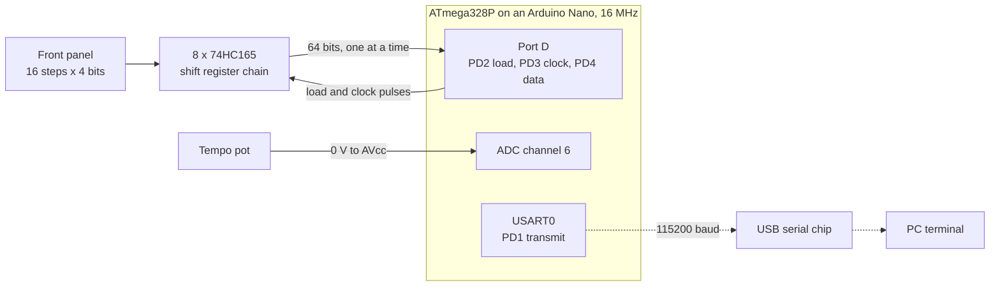

## Structure: ports and adapters

The sequencer logic is a pure core. It never touches hardware: the app gathers inputs through ports, hands them to the core, and applies what the core returns.

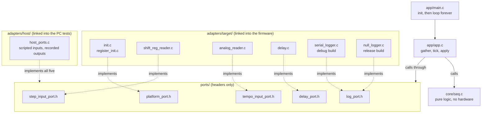

Solid arrows are calls; dotted arrows show which file supplies the functions a port header declares. The core sits to one side: it calls nothing and nothing but the app calls it.

| Folder | Role | May touch hardware |
|---|---|---|
| `core/` | Sequencer logic. Plain C99; includes only its own headers and `<stdint.h>`, `<stdbool.h>`, `<stddef.h>` | No |
| `ports/` | Headers describing what the app needs from outside: one small header per need | No |
| `adapters/target/` | The ports implemented for the ATmega328P | Yes — the only place |
| `adapters/host/` | The ports faked for PC tests: scripted inputs, recorded outputs | No |
| `app/` | Wires ports to the core; holds `main` | No |
| `tests/` | Host test programs and a small assert-based harness | No |
| `tools/sim/` | An emulated board that runs the built firmware images (JavaScript, not firmware source) | No |

Ports are bound at link time: the firmware links `adapters/target/`, the tests link `adapters/host/`, and both use the same headers. There are no function-pointer tables. The debug and release builds are the same idea one level down: `adapters/target/` holds two implementations of the log port, and the Makefile links one of them (see Build configurations below).

### The ports

| Port | Function | Target implementation |
|---|---|---|
| `platform_port.h` | `platform_init()` | `init.c`: logger, then pin directions and ADC |
| `step_input_port.h` | `step_input_read(p_raw_bits, byte_count)` | `shift_reg_reader.c`: 74HC165 chain |
| `tempo_input_port.h` | `tempo_input_read(p_raw)` | `analog_reader.c`: ADC channel 6 |
| `delay_port.h` | `delay_wait_ms(ms)` | `delay.c`: calibrated busy-wait |
| `log_port.h` | `log_step_note(step, note)`, `log_error(what, status)` | `serial_logger.c`: USART0 (debug build), or `null_logger.c`: discards everything (release build) |

Functions that can fail return `port_status_t` (`STATUS_OK` = 0, `ERR_INVALID_PARAM` = 2, `ERR_TIMEOUT` = 4, and so on). The numbers appear in the debug build's serial log, so they are fixed.

## What "bare metal" means here

No source file includes an avr-libc header. Registers are declared in `adapters/target/atmega328p_regs.h` (and `atmega328p_usart_regs.h` for USART0) and placed by the linker, and the delay comes from the `__builtin_avr_delay_cycles` compiler builtin. There is no `printf`, `memset` or any other library function; the logger converts numbers to text itself. The build uses `-ffreestanding`, so `<stdint.h>`, `<stdbool.h>` and `<stddef.h>` are the compiler's own.

The link step is not library-free. The Makefile links with plain `avr-gcc -mmcu=atmega328p`, so the map file shows:

- `crtatmega328p.o`, which ships with avr-libc. It supplies the interrupt vector table, `__bad_interrupt`, and the `__init` code that sets the stack pointer and calls `main`.
- From libgcc: `__do_clear_bss`, `__do_copy_data`, `_exit`, and `__udivmodhi4` (16-bit divide, used when converting numbers to decimal).
- `libc.a` and `libm.a` are searched, but nothing is pulled from them.

## Reset to main loop


If `platform_init()` fails, `app_init()` logs it and `main` returns the status; execution then falls into libgcc's `_exit`, which disables interrupts and loops forever. Neither target init function can currently fail.

The same thing as states:

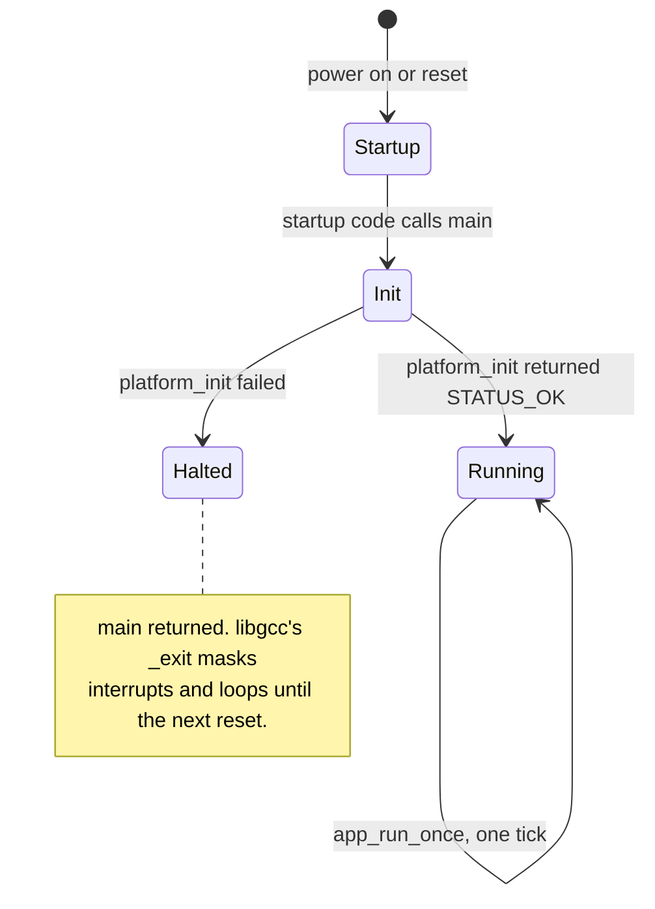

## One tick

`app_run_once()` in [`app/app.c`](../app/app.c) runs three steps:

1. **Gather inputs.** Read 8 raw bytes from the step input port and one reading from the tempo port. Each read's success becomes a valid flag in `seq_inputs_t`.
2. **Run the core.** `seq_tick()` picks the step to play, decodes its note, and works out the delay.
3. **Apply outputs.** Log the step played and its note (or one error if the step read failed), log an error if the tempo read failed, then wait `delay_ms`.

The data that moves through those three steps, with the struct fields that carry it:

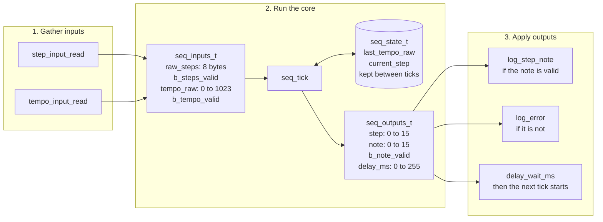

The two read statuses also go straight from step 1 to step 3 (not through the core), so a failed read can be logged with its status code.

A tick is one step of the pattern. The whole panel is read every tick, but only the step being played is decoded and logged, and the tempo pot sets the pause before the next step. Sixteen ticks go once round the pattern.

**Where the time goes.** In the debug build, logging is blocking and is the largest fixed cost, but it is now small: one line (`Step N Note = M\r\n`) of 17 to 19 characters per tick, about 1.6 ms at 115200 baud. When every tick logged all 16 steps it was about 25 ms, and at 9600 baud about 0.3 s, more than the largest possible tempo delay of 255 ms. The shift register read and the ADC conversion together take well under a millisecond, and in the release build they are all that is left besides the delay.

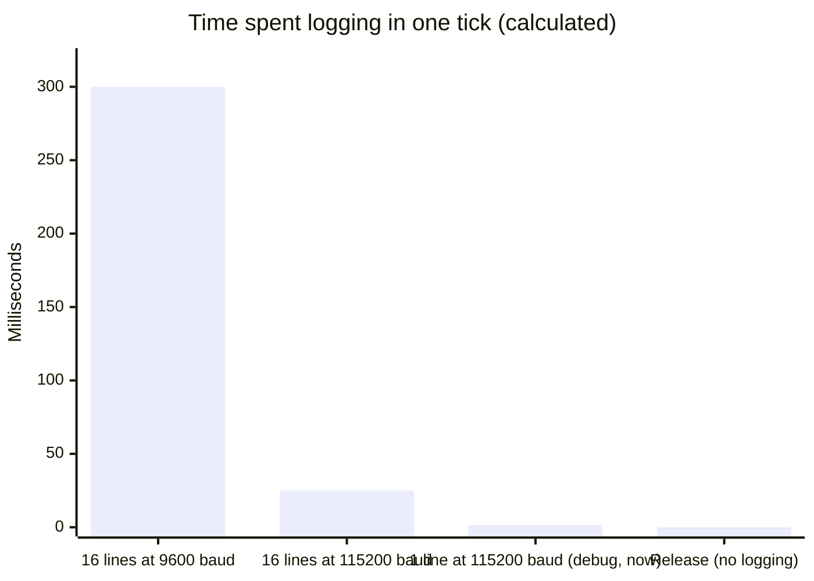

For scale, the tempo delay that follows the log is 0 to 255 ms, set by the pot.

## The core — `core/seq.c`

```c
void seq_init(seq_state_t *p_state);
void seq_tick(seq_state_t *p_state, const seq_inputs_t *p_in, seq_outputs_t *p_out);
```

`seq_tick()` reads the state and inputs, writes the state and outputs, and does nothing else.

- **Note decoding.** The 64 input bits are packed MSB first, 4 bits per step: step 0 is the high nibble of byte 0, step 1 the low nibble, step 2 the high nibble of byte 1, and so on. Only the step being played is decoded. If the step inputs are flagged invalid, the note is 0 and `b_note_valid` is false.
- **Delay.** `delay_ms` is the tempo reading divided by 4, giving 0 to 255 ms over the 10-bit range.
- **Step advance.** Each tick plays one step and then moves to the next, wrapping from step 15 to step 0. The outputs carry the step played (`step`) and its note (`note`). The note comes from that tick's inputs, so a change on the panel is heard the next time its step comes round. The step advances on every tick, including one whose step read failed (that tick's note is 0), so a failed read does not shift the pattern in time. The first tick after `seq_init()` plays step 0.
- **State.** The last valid tempo reading and the step the next tick will play. When a tempo read fails, the previous reading is reused, so the loop keeps its pace. Before any valid reading the delay is 0.

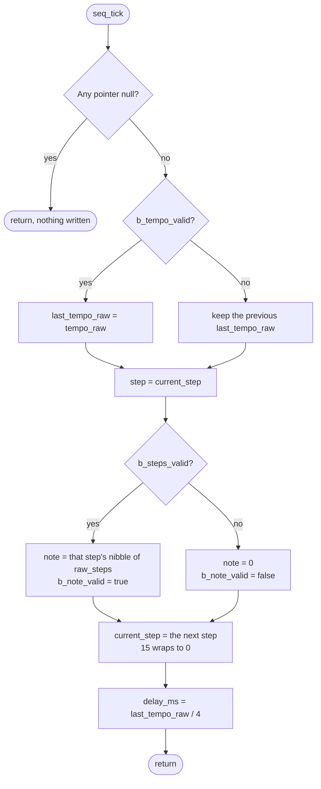

Over successive ticks the step goes round the pattern:

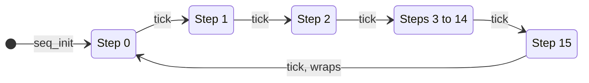

Which nibble of the eight raw bytes belongs to each step:

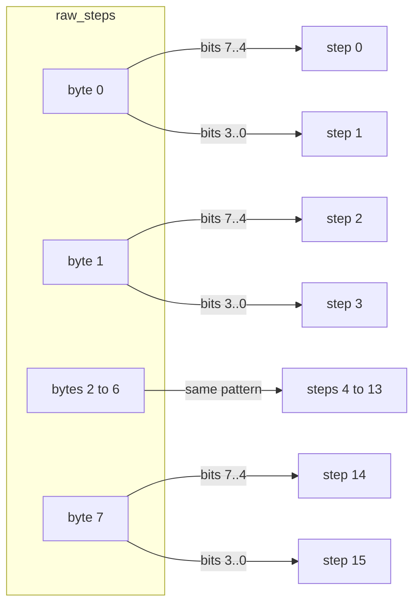

## Target adapters — `adapters/target/`

### Register map — `atmega328p_regs.h` and `atmega328p_regs.ld`

Each register is declared as an ordinary variable, for example `extern volatile uint8_t PORTD;`, with no address in the C source. The linker places each name at its datasheet address using `atmega328p_regs.ld`, which the Makefile passes as an extra linker input. A register must appear in both files; one missing from the `.ld` file fails at link time with an undefined reference, but a wrong address there links silently.

The USART0 registers and their bit positions are declared in a second header, `atmega328p_usart_regs.h`, on the same scheme and with their addresses in the same `.ld` file. Only `serial_logger.c` includes it. The release build does not link that file, so with the bit positions in the main header they would be macros nothing in the release firmware uses (MISRA rule 2.5).

Registers in the low I/O range carry avr-gcc's `io_low` attribute, which lets the compiler keep using single-instruction bit operations (`sbi`, `cbi`, `sbis`) even though it cannot see the address. The generated code is identical to the earlier pointer-cast form. `ADC` is a 16-bit variable at 0x78, which reads ADCL then ADCH.

### Pin and ADC setup — `register_init.c`

| Pin | Nano label | Direction | Used for |
|---|---|---|---|
| PB5 | D13 (on-board LED) | output | Nothing yet; never written |
| PC0 | A0 | input | Nothing yet; never read |
| PC1 | A1 | output | Nothing yet; never written |
| PD2 | D2 | output | 74HC165 SH/LD (load, active low) |
| PD3 | D3 | output | 74HC165 CLK |
| PD4 | D4 | input | 74HC165 serial data (QH of nearest chip) |
| ADC6 | A6 | analog | Tempo pot |

The ADC is enabled with a prescaler of 128, giving a 125 kHz ADC clock from 16 MHz. A normal conversion takes 13 ADC clocks, about 104 µs.

### Tempo input — `analog_reader.c`

Writes `ADMUX` with AVcc as the reference and channel 6, sets `ADSC` to start a single conversion, polls until the hardware clears `ADSC`, then copies out the 10-bit result. The wait is bounded: after 10000 polls (a few milliseconds, against a worst-case conversion of about 200 µs) it returns `ERR_TIMEOUT`.

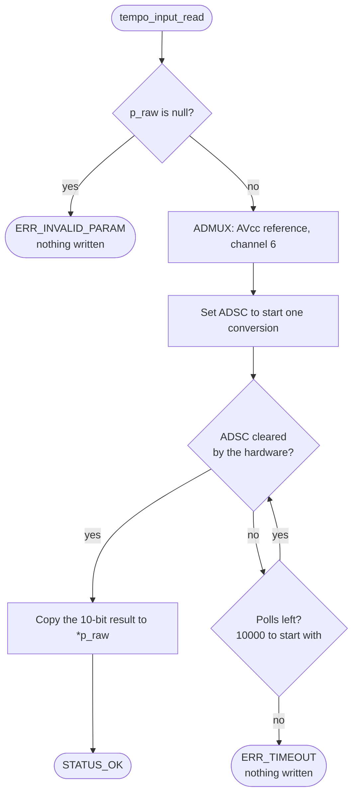

### Step input — `shift_reg_reader.c`

Pulses PD2 low then high to latch all parallel inputs, then for each byte reads PD4 and pulses PD3 eight times. The bit is sampled before the clock pulse, which is correct for the 74HC165: the first bit is already on QH after the load. Bits are shifted in MSB first, which fixes the wiring-to-step mapping:

| | Bits 7..4 | Bits 3..0 |
|---|---|---|
| 74HC165 inputs | H G F E | D C B A |
| Chip `k` (0 = nearest the MCU) | step `2k` | step `2k + 1` |

Within each nibble the higher-lettered input is the more significant bit, so input H of the nearest chip is the MSB of step 0. Each chip's Clock Inhibit pin must be tied to GND. The clock and load pulses are a single `sbi`/`cbi` pair, about 125 ns wide at 16 MHz, comfortably above the 74HC165's minimum at 5 V.

The chain, with data moving right to left towards the MCU. Chip 0's bits arrive first and land in byte 0:

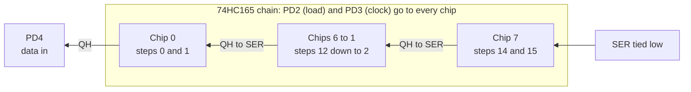

One read, as the pulses the MCU sends and the bits it gets back:

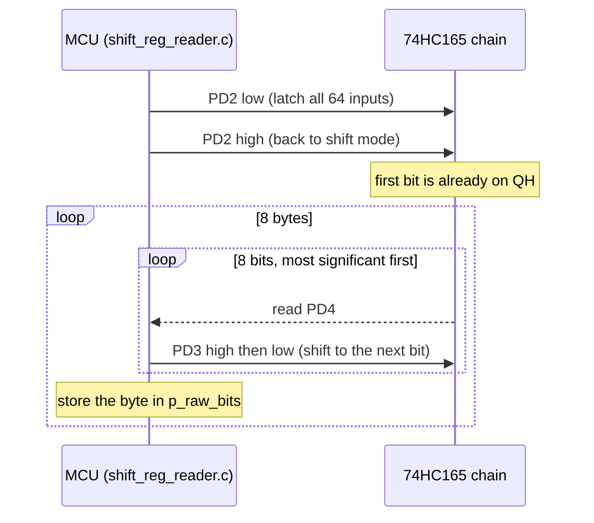

### Log — `serial_logger.c` (debug build)

`logger_init()` sets the baud divisor from `F_CPU` for 115200 baud in double-speed mode (`16000000 / (8 × 115200) − 1 = 16.4`, rounded to the nearest divisor, 16), sets double speed and 8N1 explicitly, and enables the transmitter and receiver. Nothing reads from the UART.

A divisor of 16 gives 117647 baud, 2.1 % fast. That is the usual setting for 115200 on a 16 MHz AVR and what USB serial bridges are routinely run at, but it is not exact. Normal-speed mode cannot do better (its nearest divisor is 8.5 % off), which is why double speed is used. The rates that are exact at 16 MHz are 250000, 500000 and 1000000; changing `BAUD` in `serial_logger.c` is enough to switch, and the divisor follows from it.

The port functions `log_step_note()` and `log_error()` own the message wording. Each checks the log level, then sends the message in pieces: fixed text through `write_text()` and numbers through `write_decimal()`, which produces unpadded decimal digits. Every byte goes through `write_char()`, which busy-waits on `UDRE0`. There is no format buffer, so nothing can be truncated. The level is set to DEBUG at init, so step notes (DEBUG) and errors (ERROR) both print.

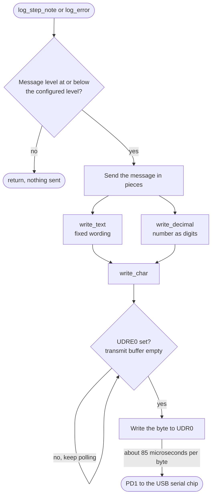

### Log — `null_logger.c` (release build)

The same three functions (`logger_init()`, `log_step_note()`, `log_error()`) with empty bodies. It touches no registers, so the USART is never set up or enabled, and it keeps no state. The app still calls the log port once per tick; the call returns immediately.

### Delay — `delay.c`

`delay_wait_ms()` loops `__builtin_avr_delay_cycles(F_CPU / 1000)` once per millisecond.

## Host side — `adapters/host/` and `tests/`

`adapters/host/host_ports.c` implements every port for the PC. Tests script what the input ports return (data and status) and read back a record of every output-port call in order. `make test` builds and runs ten programs with the PC compiler under `-std=c99 -pedantic -Wconversion -Wshadow -Werror`.

Two link the code they test:

- `test_seq`: the core alone. Decoding of every step and nibble, the step advance (starts at 0, one step per tick, wraps, takes its note from that tick's inputs, and keeps going through failed reads), the delay maths, last-valid-tempo reuse, independence of the two valid flags, and null-pointer handling.
- `test_app`: the real `app.c` and core linked against the fakes. Checks that a tick logs the step played and its note and then delays once, that successive ticks log successive steps and wrap, that a failed read logs the right error in the right place, and that init failure is logged and returned.

The other eight `#include` the one source file they test, with `tests/fake_atmega328p_regs.h` standing in for the register map (it claims the include guards of both real register headers) and any function that file calls but does not define supplied as a stub by the test:

- `test_serial_logger`: the USART setup values (divisor 16, double speed, 8N1), the level filter, the wait for a full transmit buffer, and that every message is byte-for-byte what the earlier `printf`-style format strings produced.
- `test_null_logger`: init succeeds at any level, every message is discarded, and no USART register is written.
- `test_register_init`: which direction bits are set and cleared, that the others and the output levels are left alone, and the ADC enable and prescaler value.
- `test_analog_reader`: channel and reference selection, the result, a slow conversion, the timeout at exactly the poll budget, and parameter checks. The fake ADC clears its start bit after a set number of polls.
- `test_shift_reg_reader`: every bit of the chain lands in the right place, one load pulse and eight clocks per byte, the lines left idle, other port D pins untouched, and parameter checks. The fake models the 74HC165 chain from the load and clock lines, so a read only returns the right bytes if the pulses come in the right order.
- `test_init`: logger bring-up before registers, at DEBUG level, and each failure returned.
- `test_delay`: one call to the delay builtin per millisecond, each for `F_CPU / 1000` cycles. The test defines a function with the builtin's name.
- `test_main`: `main()` (renamed while included) returns the status when init fails and otherwise loops calling `app_run_once`. The stub leaves the endless loop with `longjmp`.

Which program tests which source file. Solid arrows link the real file; dotted arrows `#include` it against the fake registers:

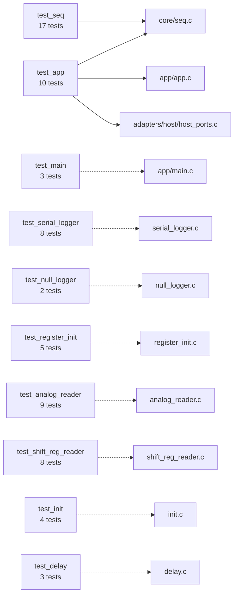

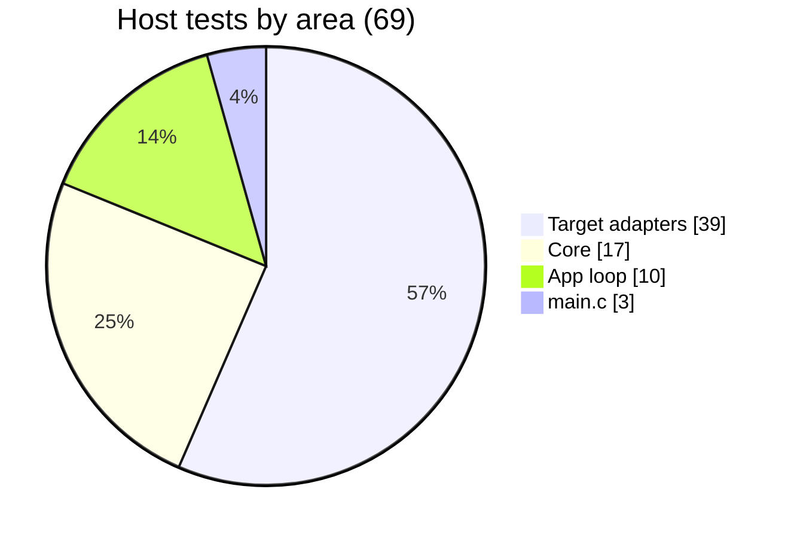

### Coverage

`make coverage` rebuilds the same programs with `--coverage -O0` into `build/coverage/`, runs them, and has `tools/coverage/report.py` add up gcov's counts per source line across all the programs. It fails unless every `.c` file in `core/`, `app/` and `adapters/target/` has every line executed and every branch taken at least once; a firmware file no test compiles counts as a failure. `adapters/host/host_ports.c` is test support: its figures are printed (97% of lines, 75% of branches) but not enforced, and the tests themselves are not measured.

What this does not show: the fakes are plain variables, so nothing here checks a register's address, the `sbi`/`cbi` instructions the pulses rely on, real timing, or what the hardware does in response. The emulated board below covers the first three; the last still needs the board.

## Emulated board — `tools/sim/`

`make sim` builds both configurations and runs each `output.hex`, exactly as it would be flashed, on an emulated ATmega328P. The emulator is the [avr8js](https://github.com/wokwi/avr8js) library (version pinned in `tools/sim/package-lock.json`), run under Node with its built-in test runner. Time is counted in CPU cycles at 16 MHz, so every run gives the same result.

| Folder | Holds | Knows about the sequencer |
|---|---|---|
| `lib/` | `machine.js`: loads the HEX file and builds the chip (CPU, ports B to D, ADC, USART0) | No |
| `parts/` | `hc165.js`: a 74HC165 chain driven from its load, clock and data wires | No |
| `boards/` | `nano_sequencer.js`: which part is on which pin, the panel switches, the tempo pot, serial capture | Yes |
| `scenarios/` | `debug.test.js`, `release.test.js`: what each image must do | Yes |

The first two folders are kept free of anything specific to this project so they can be lifted out for another one.

Eight scenarios run. For the debug image: every log line matches the switches set on the emulated panel across two passes of the pattern; the USART is set to 115200 baud in double-speed mode; each step reads the panel once with 64 clock pulses; a switch changed mid-pattern is heard the next time its step plays; and a step lasts the tempo delay plus under 2 ms. For the release image: the USART is never enabled, nothing is sent and PD0 and PD1 are left as inputs; each panel read has 64 clock pulses; and a step lasts the tempo delay plus under 1 ms.

Measured there (the figures elsewhere in this document are calculated): a debug tick takes 1.5 to 1.7 ms besides the tempo delay (longer when the step or note has two digits), so with the pot at zero the pattern runs at about 625 steps per second.

What this does not show: the chip and the parts are models. The 74HC165 model follows the datasheet's logic (the load input is level-sensitive) but has no setup, hold or pulse-width limits, nothing analog is modelled, and only the GPIO, ADC and USART parts of avr8js have been exercised. `make sim` is not part of the coverage figure.

## Build — `Makefile`

`make` compiles every `.c` under `app/`, `core/` and `adapters/target/` (less the logger the configuration does not use) into `build/obj/`, links `build/<config>/output.elf`, converts to Intel HEX, and prints a size report. `make flash` uploads with avrdude at 57600 baud (the old-bootloader Nano setting), with the signature check and verification on. `make test`, `make coverage` and `make misra` are described above and in the README. The Makefile handles Windows, macOS and Linux; only Windows has been exercised.

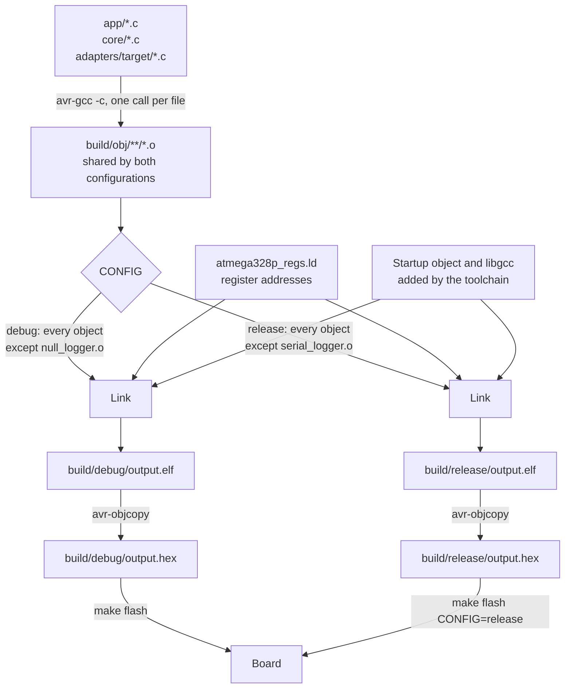

### Build configurations

`CONFIG=debug` (the default) and `CONFIG=release` differ in one thing: which of `serial_logger.c` and `null_logger.c` is linked. There are no configuration macros and no conditional compilation; every source file is compiled the same way for both, so the two share `build/obj/`. Each has its own output folder (`build/debug/`, `build/release/`), so switching back and forth cannot leave a stale image. `make flash CONFIG=release` uploads the release image. `make test`, `make coverage` and `make misra` do not take a configuration: they always cover both loggers.

| | Debug | Release |
|---|---:|---:|
| Flash | 1294 bytes | 762 bytes |
| Static RAM | 5 bytes | 3 bytes |
| Time per tick besides the tempo delay | about 2 ms | under 1 ms |

A lower baud rate for release was considered and has no use: the release build never switches the USART on, so it has no baud rate.

### Where the flash goes

Sizes of the linked functions and data, from `avr-nm --size-sort` on each `output.elf`, grouped by source. The debug build:

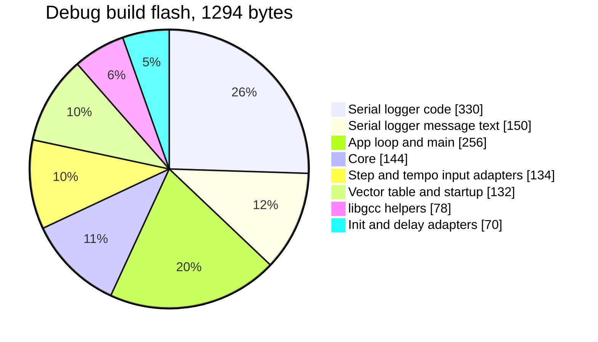

| Part | Debug | Release |
|---|---:|---:|
| Logger (code and message text) | 480 | 10 |
| App loop and `main` | 256 | 256 |
| Core | 144 | 144 |
| Step and tempo input adapters | 134 | 134 |
| Vector table and startup code | 132 | 132 |
| libgcc helpers | 78 | 16 |
| Init and delay adapters | 70 | 70 |
| **Total** | **1294** | **762** |

The serial logger is over a third of the debug image. The release build also sheds two libgcc helpers that only the logger needed: the 16-bit divide used to print decimal numbers, and the routine that copies initialised data (the message text) into RAM at startup. Either build uses under 5 % of the 30720 bytes available below the old bootloader.

## Static analysis

`make misra` runs cppcheck with its MISRA addon three times, each time over the files that are linked together for that build: the debug firmware (`core/`, `ports/`, `app/`, `adapters/target/` without `null_logger.c`), the release firmware (the same without `serial_logger.c`) and the `test_app` host program (`core/`, `ports/`, `app/app.c`, `adapters/host/`, `tests/test_app.c`). Counts before the refactor are in [misra-baseline.md](misra-baseline.md): 165 findings, 5 of them mandatory and 101 required. There are now none, and no inline suppressions or deviations in the source.

Two things about scope: findings located in `tests/` are not reported, because test code is not held to the coding standard; the test file is in the host run only so cppcheck can see the host fakes being called. And cppcheck implements only part of MISRA C, so zero findings means zero from this tool, not a claim of full compliance. The `io_low` attribute in the register header and the delay builtin are compiler extensions that the tool does not flag.

How findings are handled is set out in [tools/misra/CLAUDE.md](../tools/misra/CLAUDE.md).


## Open items

Earlier findings from this analysis that have since been fixed are in the git history (log level filter, flash port default, header dependency tracking, register map, UART setup, robustness gaps, stale comments, Makefile flags, coding-standard cleanup of the target adapters). What remains:

### 1. The tempo range has no lower limit on the delay

The delay between steps is the pot reading divided by 4: 0 to 255 ms. At the slow end that is about 4 steps per second. At the fast end the delay is 0, so the pattern runs as fast as the loop can go: several hundred steps per second in the debug build and a few thousand in the release build. Nothing useful happens up there. The mapping from pot to delay needs a floor, and probably a wider and more musical range, before an output stage makes the steps audible. That is a change to the core.

### 2. Unused pins are configured

PB5, PC0 and PC1 are given a direction in `register_init.c` but never read or written. PD0, the USART receive pin, used to be set as an output there as well; that line was removed, because the release build never enables the receiver and would have driven the pin against the board's USB serial chip. PD0 and PD1 are now left as they are at reset (inputs) unless the serial logger takes them over.

### 3. The debug build plays slightly slower than the release build

The step period is the tempo delay plus the time the rest of the tick takes: about 2 ms in the debug build (mostly the one log line) and under 1 ms in the release build. At slow tempos the difference is under 1 %; at fast ones it is most of the period. It goes away once the step period comes from a timer instead of a blocking delay.

### 4. No crash log

Nothing records a reset or an error across power cycles, and the release build has no logging at all. A persistent error log in EEPROM is wanted and there is ample space, but it waits until there is a watchdog and an output stage, so that it can record real resets.

## What the output stage will need

- **Step advance**: done. `seq_state_t` holds the current step, advanced once per tick; `seq_outputs_t` carries the step played and its note, and the app logs that one step.
- **A usable tempo range** (open item 1), in the core.
- **A new output port** (gate, trigger or CV) with a target adapter and a host fake. PB5, PC0 and PC1 are already configured and free.
- **New register definitions** in `atmega328p_regs.h` (and addresses in the `.ld` file) for whatever drives the output: timer registers for PWM-based CV, or SPI registers for an external DAC.
- **A timing decision.** `delay_wait_ms` blocks, so the inputs are only re-read between steps. A timer interrupt would be the next step up; under the project rules it would only bump a tick counter, with the core still called from the main loop.
- **A gate length.** A step currently has no duration of its own; a gate or trigger output needs to know how long to stay on within the step period.
