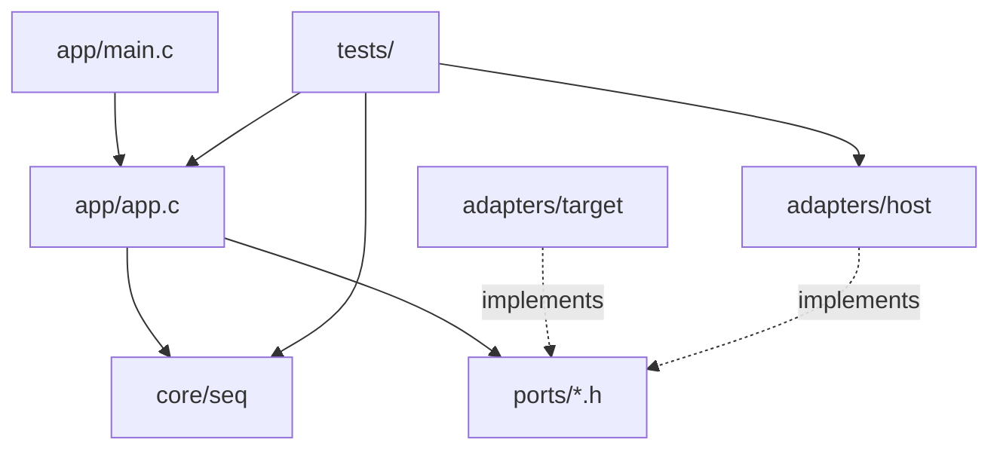
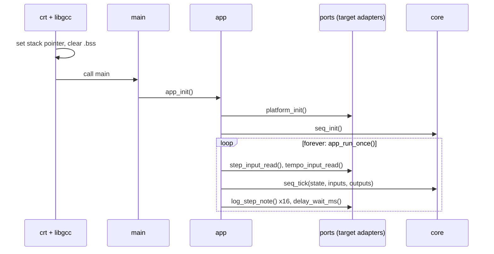

# nano_sequencer — architecture and inner workings

How the firmware is structured, what happens from reset to the main loop, how each part works, and what is still open. The standing rules for the codebase are in [CLAUDE.md](../CLAUDE.md); this document describes what is there.

How this was checked: the firmware is compiled with avr-gcc 12.1.0 under `-std=c99 -Wall -Wextra -Wconversion -Wshadow -Werror`, and the hardware-free parts are compiled and tested on a PC with `make test`. The firmware was last run on the board before the ports-and-adapters refactor; the refactored build has not been flashed yet, so timing figures are calculated, not measured.

## At a glance

| | |
|---|---|
| Target | ATmega328P (Arduino Nano), 16 MHz |
| Flash used | 1850 bytes of 32 KB |
| RAM used | 68 bytes static (64-byte log buffer, 2-byte log level, 2-byte sequencer state), plus stack |
| Interrupts | None. Everything is polled and blocking |
| Inputs | 16 steps × 4 bits from eight 74HC165s; one pot on ADC channel 6 for tempo |
| Outputs | Serial log only (9600 baud). No gate, trigger or CV output yet |
| Tests | 21 host tests (12 for the core, 9 for the app loop) |

## Structure: ports and adapters

The sequencer logic is a pure core. It never touches hardware: the app gathers inputs through ports, hands them to the core, and applies what the core returns.



| Folder | Role | May touch hardware |
|---|---|---|
| `core/` | Sequencer logic. Plain C99; includes only its own headers and `<stdint.h>`, `<stdbool.h>`, `<stddef.h>` | No |
| `ports/` | Headers describing what the app needs from outside: one small header per need | No |
| `adapters/target/` | The ports implemented for the ATmega328P | Yes — the only place |
| `adapters/host/` | The ports faked for PC tests: scripted inputs, recorded outputs | No |
| `app/` | Wires ports to the core; holds `main` | No |
| `tests/` | Host test programs and a small assert-based harness | No |

Ports are bound at link time: the firmware links `adapters/target/`, the tests link `adapters/host/`, and both use the same headers. There are no function-pointer tables.

### The ports

| Port | Function | Target implementation |
|---|---|---|
| `platform_port.h` | `platform_init()` | `init.c`: serial logger, then pin directions and ADC |
| `step_input_port.h` | `step_input_read(p_raw_bits, byte_count)` | `shift_reg_reader.c`: 74HC165 chain |
| `tempo_input_port.h` | `tempo_input_read(p_raw)` | `analog_reader.c`: ADC channel 6 |
| `delay_port.h` | `delay_wait_ms(ms)` | `delay.c`: calibrated busy-wait |
| `log_port.h` | `log_step_note(step, note)`, `log_error(what, status)` | `serial_logger.c`: USART0 |

Functions that can fail return `port_status_t` (`STATUS_OK` = 0, `ERR_INVALID_PARAM` = 2, `ERR_TIMEOUT` = 4, and so on). The numbers appear in the serial log, so they are fixed.

## What "bare metal" means here

No source file includes an avr-libc header. Registers come from `adapters/target/atmega328p_regs.h`, variadic support from the compiler builtins in `varargs.h`, and the delay from `__builtin_avr_delay_cycles`. The build uses `-ffreestanding`, so `<stdint.h>`, `<stdbool.h>` and `<stddef.h>` are the compiler's own.

The link step is not library-free. The Makefile links with plain `avr-gcc -mmcu=atmega328p`, so the map file shows:

- `crtatmega328p.o`, which ships with avr-libc. It supplies the interrupt vector table, `__bad_interrupt`, and the `__init` code that sets the stack pointer and calls `main`.
- From libgcc: `__do_clear_bss`, `__do_copy_data`, `_exit`, and `__udivmodhi4` (16-bit divide, used by the `%d` formatter).
- `libc.a` and `libm.a` are searched, but nothing is pulled from them.

## Reset to main loop



If `platform_init()` fails, `app_init()` logs it and `main` returns the status; execution then falls into libgcc's `_exit`, which disables interrupts and loops forever. Neither target init function can currently fail.

## One tick

`app_run_once()` in [`app/app.c`](../app/app.c) runs three steps:

1. **Gather inputs.** Read 8 raw bytes from the step input port and one reading from the tempo port. Each read's success becomes a valid flag in `seq_inputs_t`.
2. **Run the core.** `seq_tick()` decodes the notes and works out the delay.
3. **Apply outputs.** Log the 16 notes (or one error if the step read failed), log an error if the tempo read failed, then wait `delay_ms`.

There is no notion of a "current step" yet. A tick is a sample-and-print sweep, and the tempo pot sets the pause between sweeps.

**Where the time goes.** Logging is blocking and dominates. Each line (`Step N Note = M\r\n`) is 17 to 19 characters, so a sweep sends about 280 to 295 characters. At 9600 baud that is roughly 0.3 s per tick, more than the largest possible tempo delay of 255 ms. The shift register read and the ADC conversion together take well under a millisecond.

## The core — `core/seq.c`

```c
void seq_init(seq_state_t *p_state);
void seq_tick(seq_state_t *p_state, const seq_inputs_t *p_in, seq_outputs_t *p_out);
```

`seq_tick()` reads the state and inputs, writes the state and outputs, and does nothing else.

- **Note decoding.** The 64 input bits are packed MSB first, 4 bits per step: step 0 is the high nibble of byte 0, step 1 the low nibble, step 2 the high nibble of byte 1, and so on. If the step inputs are flagged invalid, every note is 0 and `b_notes_valid` is false.
- **Delay.** `delay_ms` is the tempo reading divided by 4, giving 0 to 255 ms over the 10-bit range.
- **State.** The last valid tempo reading. When a tempo read fails, the previous reading is reused, so the loop keeps its pace. Before any valid reading the delay is 0.

## Target adapters — `adapters/target/`

### Register map — `atmega328p_regs.h`

Each register is a macro that dereferences a fixed address, for example `#define PORTD (*((volatile unsigned char*)0x2B))`. `ADC` is a 16-bit access at 0x78, which reads ADCL then ADCH. The file disables `-Warray-bounds` for everything that includes it, because GCC 12 flags fixed-address dereferences as out-of-bounds.

### Pin and ADC setup — `register_init.c`

| Pin | Nano label | Direction | Used for |
|---|---|---|---|
| PB5 | D13 (on-board LED) | output | Nothing yet; never written |
| PC0 | A0 | input | Nothing yet; never read |
| PC1 | A1 | output | Nothing yet; never written |
| PD0 | D0 / RXD | output | See open item 2 |
| PD2 | D2 | output | 74HC165 SH/LD (load, active low) |
| PD3 | D3 | output | 74HC165 CLK |
| PD4 | D4 | input | 74HC165 serial data (QH of nearest chip) |
| ADC6 | A6 | analog | Tempo pot |

The ADC is enabled with a prescaler of 128, giving a 125 kHz ADC clock from 16 MHz. A normal conversion takes 13 ADC clocks, about 104 µs.

### Tempo input — `analog_reader.c`

Writes `ADMUX` with AVcc as the reference and channel 6, sets `ADSC` to start a single conversion, polls until the hardware clears `ADSC`, then copies out the 10-bit result. The wait is bounded: after 10000 polls (a few milliseconds, against a worst-case conversion of about 200 µs) it returns `ERR_TIMEOUT`.

### Step input — `shift_reg_reader.c`

Pulses PD2 low then high to latch all parallel inputs, then for each byte reads PD4 and pulses PD3 eight times. The bit is sampled before the clock pulse, which is correct for the 74HC165: the first bit is already on QH after the load. Bits are shifted in MSB first, which fixes the wiring-to-step mapping:

| | Bits 7..4 | Bits 3..0 |
|---|---|---|
| 74HC165 inputs | H G F E | D C B A |
| Chip `k` (0 = nearest the MCU) | step `2k` | step `2k + 1` |

Within each nibble the higher-lettered input is the more significant bit, so input H of the nearest chip is the MSB of step 0. Each chip's Clock Inhibit pin must be tied to GND. The clock and load pulses are a single `sbi`/`cbi` pair, about 125 ns wide at 16 MHz, comfortably above the 74HC165's minimum at 5 V.

### Log — `serial_logger.c`

`serial_init()` sets the baud divisor from `F_CPU` (`16000000 / (16 × 9600) − 1 = 103`, about 0.2 % error), sets normal speed and 8N1 explicitly, and enables the transmitter and receiver. Nothing reads from the UART.

The port functions `log_step_note()` and `log_error()` own the message wording and call `log_serial()`, which filters by level, formats into a 64-byte `static` buffer with the project's own `vsnprintf`, and sends it one byte at a time, busy-waiting on `UDRE0`. A message that does not fit is followed by `[TRUNCATED]` on its own line. The level is set to DEBUG at init, so everything except TRACE prints.

### Delay and utilities — `delay.c`, `utilities.c`

- `delay_wait_ms()` loops `__builtin_avr_delay_cycles(F_CPU / 1000)` once per millisecond.
- `vsnprintf()` supports `%d` and `%%` only; any other specifier is emitted literally. It returns the length the full output would have had, and handles `INT_MIN` without overflow.
- `memset()` and `memmove()` are standard implementations. Nothing calls them directly, and `--gc-sections` drops them unless the compiler emits a call.

## Host side — `adapters/host/` and `tests/`

`adapters/host/host_ports.c` implements every port for the PC. Tests script what the input ports return (data and status) and read back a record of every output-port call in order. `make test` builds and runs two programs with the PC compiler under `-std=c99 -pedantic -Wconversion -Wshadow -Werror`:

- `test_seq`: the core alone. Decoding of every step and nibble, the delay maths, last-valid-tempo reuse, independence of the two valid flags, and null-pointer handling.
- `test_app`: the real `app.c` and core linked against the fakes. Checks that a tick logs 16 notes in order and then delays once, that a failed read logs the right error in the right place, and that init failure is logged and returned.

The target adapters themselves are not covered by host tests; they need the board.

## Build — `Makefile`

`make` compiles every `.c` under `app/`, `core/` and `adapters/target/` into `build/obj/`, links `build/output.elf`, converts to Intel HEX, and prints a size report. `make flash` uploads with avrdude at 57600 baud (the old-bootloader Nano setting), with the signature check and verification on. `make test` and `make misra` are described above and in the README. The Makefile handles Windows, macOS and Linux; only Windows has been exercised.

## Static analysis

`make misra` runs cppcheck with its MISRA addon over `core/`, `ports/`, `adapters/` and `app/`. Counts before the refactor are in [misra-baseline.md](misra-baseline.md). How findings are handled is set out in CLAUDE.md.

## Open items

Earlier findings from this analysis that have since been fixed are in the git history (log level filter, flash port default, header dependency tracking, truncation check, register map, UART setup, robustness gaps, stale comments, Makefile flags). What remains:

### 1. Blocking logging sets the real loop time

A tick spends about 0.3 s in the UART. Once the loop advances one step per tempo period, logging 16 lines per step would cap the tempo at roughly three steps per second regardless of the pot. Options are to log only the current step, raise the baud rate, or lower the log level.

### 2. PD0 is set as an output

`DDRD |= BIT_0` makes PD0 an output, but PD0 is the USART receive pin and `RXEN0` is enabled, which overrides the direction setting. The line has no effect while the receiver is on. PB5, PC0 and PC1 are configured but never used.

### 3. Tempo is sampled before logging

Because inputs are gathered before outputs are applied, the tempo pot is read about 0.3 s before the delay it controls (it used to be read just before). The serial output and the loop period are unchanged.

### 4. Legacy style in the target adapters

The code in `adapters/target/` predates the coding standard in CLAUDE.md: unbraced single-line `if`s, `int`/`unsigned char` where fixed-width types are called for, and K&R brace placement. It accounts for most of the remaining MISRA findings and is deliberately left for a separate cleanup.

## What the output stage will need

- **Step advance in the core first**, with tests: a current-step index in `seq_state_t`, advanced once per tick, and the note for that step in `seq_outputs_t`.
- **A new output port** (gate, trigger or CV) with a target adapter and a host fake. PB5, PC0 and PC1 are already configured and free.
- **New register definitions** in `atmega328p_regs.h` for whatever drives the output: timer registers for PWM-based CV, or SPI registers for an external DAC.
- **A timing decision.** `delay_wait_ms` blocks, so the inputs are only re-read between steps. A timer interrupt would be the next step up; under the project rules it would only bump a tick counter, with the core still called from the main loop.
- **Dealing with open item 1 first**, since it limits how fast the loop can run.
