# nano_sequencer — architecture and inner workings

How the firmware is structured, what happens from reset to the main loop, how each part works, and what is still open. The standing rules for the codebase are in [CLAUDE.md](../CLAUDE.md) and the `CLAUDE.md` in each source folder; this document describes what is there.

How this was checked: the firmware is compiled with avr-gcc 12.1.0 under `-std=c99 -Wall -Wextra -Wconversion -Wshadow -Werror`, and the same source is compiled and tested on a PC with `make test`, the MCU adapters against fake registers. The refactored firmware has been flashed and run on the board; the later logger rewrite, the 115200 baud setting, the release build, the step advance, the timer tick with its non-blocking loop, the addressing, note mapping and rests, the shift registers on the SPI bus (which also needs three wires moved on the board), and the gate and clock outputs have not yet. Timing figures marked as measured come from the emulated board; the rest are calculated.

## At a glance

| | |
|---|---|
| Target | ATmega328P (Arduino Nano), 16 MHz |
| Flash used | 2930 bytes of 32 KB (debug build); 2196 bytes (release build) |
| RAM used | Debug: 386 bytes static (a 128-byte log queue, 155 bytes of message text and 51 bytes of scale tables copied from flash, 52 bytes of state). Release: 98 bytes (the tables and 46 bytes of state). Plus stack |
| Interrupts | One: Timer/Counter2 compare match A, 1000 times a second. It adds one to a counter and does nothing else |
| Main loop | Never blocks. One sequencer tick per millisecond; outputs are applied at the tick boundary |
| Inputs | 16 steps × 4 bits from eight 74HC165s on the SPI bus; one pot on ADC channel 6 for tempo. Both are read every 8 ms |
| Tempo | 30 to 285 BPM, a step being a sixteenth note (500 ms down to 52.6 ms per step) |
| Notes | A step's four switches are its note value: 0 is a rest, 1 to 15 a pitch through a scale and a root |
| Pattern | The core can play any range of steps forward, in reverse or as a pendulum, looping or once, with a reset. The board has no controls for these yet, so the firmware plays all 16 steps forward, looping, in the chromatic scale |
| Outputs | A gate on PD4, high while a note is held (half a step), and a clock on PD5, one pulse per step. Both are bare 0 V to 5 V logic pins. A serial log as well in the debug build (115200 baud). No pitch CV yet |
| Tests | 204 host tests in 19 programs (102 for the core, 25 for the app loop, 74 for the ten target adapter sources, 3 for `main.c`) |
| Coverage | 100% of lines (454) and branches (187) in `core/`, `app/` and `adapters/target/`, measured on the PC build by `make coverage` |

## Hardware

What is wired to the chip, and which way each signal goes. The dotted path exists only in the debug build.

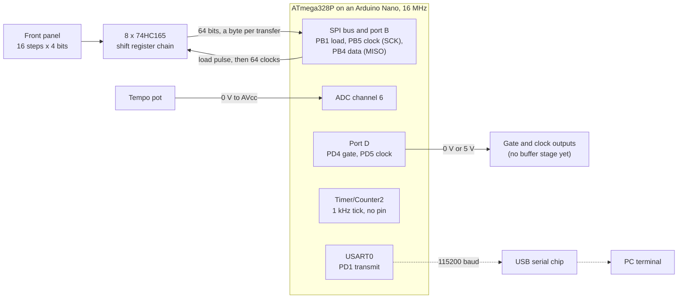

## Structure: ports and adapters

The sequencer logic is a pure core. It never touches hardware: the app gathers inputs through ports, hands them to the core, and applies what the core returns.

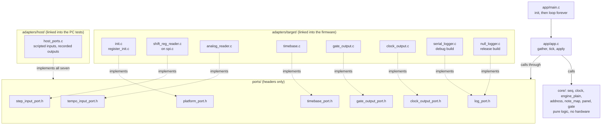

Solid arrows are calls; dotted arrows show which file supplies the functions a port header declares. The core sits to one side: it calls nothing and nothing but the app calls it.

| Folder | Role | May touch hardware |
|---|---|---|
| `core/` | Sequencer logic. Plain C99; includes only its own headers and `<stdint.h>`, `<stdbool.h>`, `<stddef.h>` | No |
| `ports/` | Headers describing what the app needs from outside: one small header per need | No |
| `adapters/target/` | The ports implemented for the ATmega328P | Yes — the only place |
| `adapters/host/` | The ports faked for PC tests: scripted inputs, recorded outputs | No |
| `app/` | Wires ports to the core; holds `main` | No |
| `tests/` | Host test programs and a small assert-based harness | No |
| `tools/sim/` | An emulated board that runs the built firmware images (JavaScript, not firmware source) | No |

Ports are bound at link time: the firmware links `adapters/target/`, the tests link `adapters/host/`, and both use the same headers. There are no function-pointer tables. The debug and release builds are the same idea one level down: `adapters/target/` holds two implementations of the log port, and the Makefile links one of them (see Build configurations below).

### The ports

| Port | Function | Target implementation |
|---|---|---|
| `platform_port.h` | `platform_init()` | `init.c`: logger, then pin directions and ADC, then the SPI bus, then the timebase |
| `step_input_port.h` | `step_input_read(p_raw_bits, byte_count)` | `shift_reg_reader.c`: 74HC165 chain, read through the SPI driver `spi.c` |
| `tempo_input_port.h` | `tempo_input_read(p_raw)` | `analog_reader.c`: ADC channel 6 |
| `timebase_port.h` | `timebase_elapsed_ticks()` | `timebase.c`: Timer/Counter2 interrupting at 1 kHz |
| `gate_output_port.h` | `gate_output_write(b_high)` | `gate_output.c`: PD4 |
| `clock_output_port.h` | `clock_output_write(b_high)` | `clock_output.c`: PD5 |
| `log_port.h` | `log_step_note(step, semitone)`, `log_step_rest(step)`, `log_error(what, status)`, `log_poll()`, `log_flush()` | `serial_logger.c`: USART0 (debug build), or `null_logger.c`: discards everything (release build) |

Functions that can fail return `port_status_t` (`STATUS_OK` = 0, `ERR_INVALID_PARAM` = 2, `ERR_TIMEOUT` = 4, and so on). The numbers appear in the debug build's serial log, so they are fixed. `timebase_elapsed_ticks()` cannot fail and returns the tick count itself. The two output writes cannot fail either and return nothing.

## What "bare metal" means here

No source file includes an avr-libc header. Registers are declared in `adapters/target/atmega328p_regs.h` (with `atmega328p_usart_regs.h` for USART0, `atmega328p_timer2_regs.h` for Timer/Counter2 and `atmega328p_spi_regs.h` for the SPI) and placed by the linker. Interrupts are enabled by setting the bit in the status register, and the one interrupt handler is an ordinary C function given avr-gcc's `signal` attribute and the name the vector table expects (`__vector_7`). No compiler builtin is used. There is no `printf`, `memset` or any other library function; the logger converts numbers to text itself. The build uses `-ffreestanding`, so `<stdint.h>`, `<stdbool.h>` and `<stddef.h>` are the compiler's own.

The link step is not library-free. The Makefile links with plain `avr-gcc -mmcu=atmega328p`, so the map file shows:

- `crtatmega328p.o`, which ships with avr-libc. It supplies the interrupt vector table, `__bad_interrupt`, and the `__init` code that sets the stack pointer and calls `main`. Every vector but the reset and the timer tick still points at `__bad_interrupt`.
- From libgcc: `__do_clear_bss`, `__do_copy_data`, `_exit`, and `__udivmodhi4` (16-bit divide, used when converting numbers to decimal).
- `libc.a` and `libm.a` are searched, but nothing is pulled from them.

## Reset to main loop

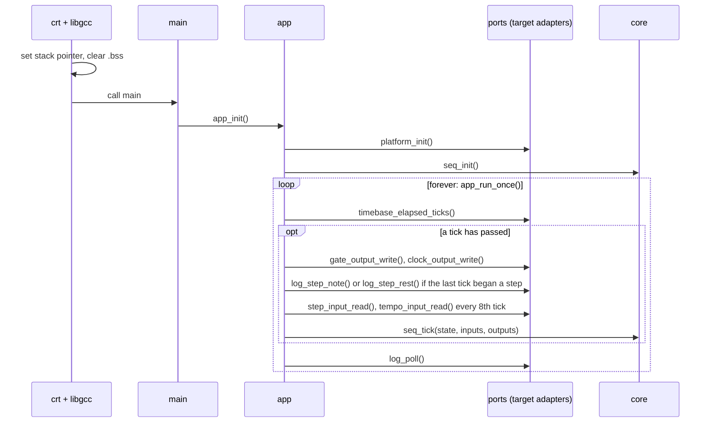

`platform_init()` ends by starting the timer and enabling interrupts, so the tick is running before the first pass of the loop. If `platform_init()` fails, `app_init()` logs it, waits for the log to be sent (`log_flush()`, the only blocking call left) and `main` returns the status; execution then falls into libgcc's `_exit`, which disables interrupts and loops forever. Neither target init function can currently fail.

The same thing as states:

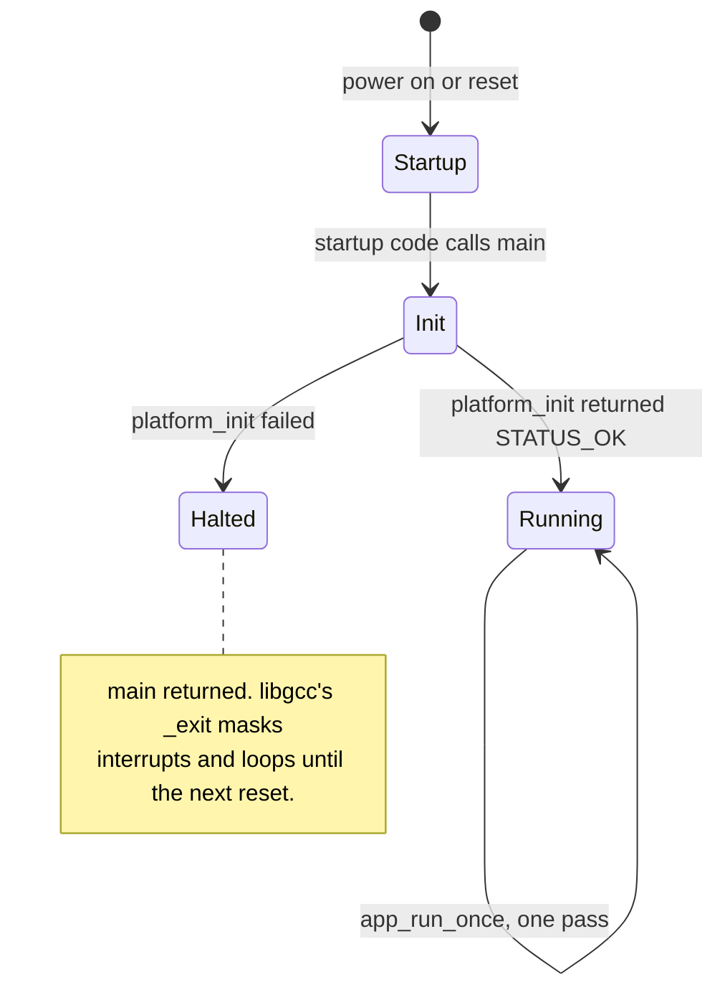

## The main loop and one tick

`main` calls `app_run_once()` in [`app/app.c`](../app/app.c) forever, and that function never waits. Each pass asks the timebase how many 1 ms ticks have gone by since the last pass.

- **None:** the pass gives the log the chance to send one byte and returns. Between ticks the loop spins through this path, a few microseconds a time.
- **One or more:** the pass runs one tick of the sequencer, in the three steps below, and then polls the log as well. More than one only happens if a pass overran; the count is handed to the core, so no time is lost.

1. **Apply outputs.** What the previous tick computed is acted on first. The gate and the clock output are set to their levels, on every tick, before anything else. Then, if a step began, log the step and its pitch, or that it is a rest (or one error if the step read had failed), and an error if the tempo read had failed.
2. **Gather inputs.** Note the elapsed ticks. Every eighth tick (125 times a second) read 8 raw bytes from the step input port and one reading from the tempo port; each read's success becomes a valid flag in `seq_inputs_t`. Between scans the core is given the last snapshot again.
3. **Run the core.** `seq_tick()` moves its clock on by the elapsed ticks and, if that brings a step due, begins it and works out its pitch. It also works out the level of the gate and of the clock output as they should stand after this tick. The result is kept until the next tick.

Outputs are applied at the start of the next tick, not at the end of this one, so they change at the same point in every tick however long the reads and the core took. The price is that every output is one tick (1 ms) late, always by the same amount. The gate and the clock output go first so that queueing a log line cannot hold their edges up.

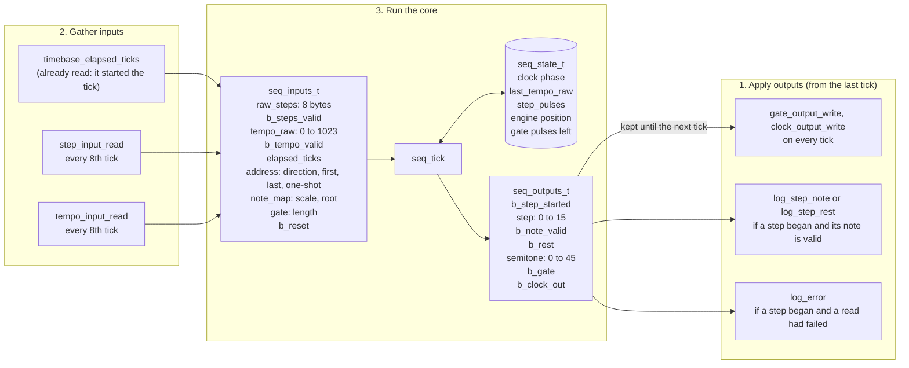

The two read statuses are kept beside the snapshot (not passed through the core), so a failed read can be logged with its status code. A failed read is reported once per step, along with the step it affected, not once per scan.

The last four inputs in the diagram (the addressing controls, the scale and root, the gate length, and reset) have no hardware behind them yet. The app sets them once, in `set_fixed_controls()`: all sixteen steps, forward, looping, never reset, in the chromatic scale from the lowest pitch, with a gate of half a step. When there are switches or pots for them, that function is what a port read replaces.

A tick is a millisecond, not a step. A step lasts 24 clock pulses, which at the tempo set by the pot is 500 ms down to 52.6 ms, so most ticks compute nothing new and apply nothing. Sixteen steps go once round the pattern.

**Timing, measured on the emulated board** at 150 BPM, where a step is exactly 100 ms:

| | Debug | Release |
|---|---|---|
| Panel scan period | 8 ms, within 0.12 ms | 8 ms, within 0.004 ms |
| Step period, from one rising edge of the clock output to the next | 100 ms, within 0.003 ms | 100 ms, within 0.003 ms |
| Gate, and the high half of the clock output | 50 ms, within 0.003 ms | 50 ms, within 0.003 ms |
| Gate edge to clock output edge | 0.9 µs, gate first | The same |
| First gate | 2.2 ms after reset | 2.1 ms after reset |
| Step period, from the first byte of one log line to the first byte of the next | 100 ms, within 0.25 ms | No log |
| Gate rising to the first byte of its step's log line | 0.10 to 0.33 ms | — |
| One log line on the wire | 1.0 ms (a rest) to 1.6 ms, sent a byte per pass while the loop carries on | — |
| First step logged | 2.3 ms after reset | — |

The step itself begins on a tick boundary in both builds, and the gate and clock output show it: their edges keep time to a few microseconds, which is how long the idle loop takes to notice a tick, and the log being sent makes no difference to them. The 0.25 ms on the log's row is the log's own jitter: a line's first byte goes out at the end of that tick's pass, after the line has been queued and, on a scan tick, after the panel and pot have been read. Over a long run nothing accumulates: 16 steps took 1600 ms to within the same margins.

The very first step after reset is one tick short (99 ms in that run, with a 49 ms gate): the first tick begins step 0 and already counts towards step 1.

## The core — `core/`

```c
void seq_init(seq_state_t *p_state);
void seq_tick(seq_state_t *p_state, const seq_inputs_t *p_in, seq_outputs_t *p_out);

void    clock_init(clock_state_t *p_state);
uint8_t clock_advance(clock_state_t *p_state, uint16_t bpm, uint8_t elapsed_ticks);

void engine_plain_init(engine_plain_state_t *p_state);
bool engine_plain_step(engine_plain_state_t *p_state, const engine_inputs_t *p_in,
                       engine_step_t *p_step);

void address_init(address_state_t *p_state);
bool address_next(address_state_t *p_state, const address_config_t *p_config,
                  uint8_t *p_step);

bool    note_map_semitone(const note_map_config_t *p_config, uint8_t note,
                          uint8_t *p_semitone);
uint8_t panel_step_value(const uint8_t *p_raw_steps, uint8_t step);

void gate_init(gate_state_t *p_state);
void gate_begin(gate_state_t *p_state, const gate_config_t *p_config, bool b_note);
bool gate_advance(gate_state_t *p_state, uint16_t pulses);
```

`seq_tick()` reads the state and inputs, writes the state and outputs, and does nothing else. Every function under it is the same kind of function one level down, and each module has its own test program.

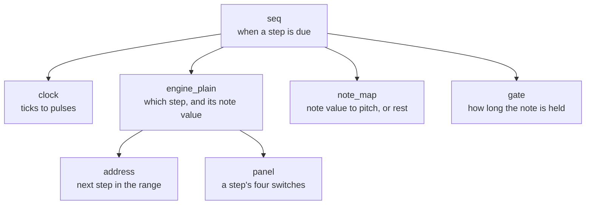

| Module | Question it answers | State it keeps |
|---|---|---|
| `seq` | Is a step due on this tick, and what are the outputs? | Tempo reading, pulses into the step, and the clock, engine and gate below |
| `clock` | How many pulses fell in these ticks? | 2 bytes of phase |
| `engine_plain` | Which step plays now, and what is its note value? | The addressing state |
| `address` | Which step comes next in this direction and range? | A count of steps played in the cycle, and a finished flag |
| `note_map` | What pitch is this note value in this scale? | None |
| `panel` | What do the four switches of this step read? | None |
| `gate` | Is the note still held? | Pulses left before the gate closes |

### The clock

The clock turns elapsed ticks into pulses, 96 to the quarter note, at a tempo in beats per minute. At B BPM there are B × 96 pulses in 60000 ticks, which is B × 8 pulses in 5000 ticks. So each tick adds B × 8 to a 16-bit phase counter, and each time the counter reaches 5000 one pulse is emitted and 5000 is taken off. Nothing is rounded, so the pulse count is exact however long it runs: the tests count exactly B × 96 pulses in a minute for a range of tempos, and no drift over ten minutes. Rounding the pulse period to whole ticks instead would be 4 % out at the fast end.

The tempo is limited to 300 BPM, which keeps the counter within 16 bits and means a tick never holds more than one pulse. A tempo of 0 stops the clock.

### The sequencer

- **Tempo.** The tempo reading (0 to 1023) maps linearly onto 30 to 285 BPM: 30 plus the reading divided by 4. The floor means the pot cannot stop the pattern or run it at an unusable speed. When a tempo read fails, the previous reading is reused, so the pattern keeps its pace. Before any valid reading the tempo is 30 BPM.
- **Step length.** A step is a sixteenth note: 24 pulses, or 15000 / BPM milliseconds. `step_pulses` counts the pulses since the current step began.
- **Step advance.** When `step_pulses` reaches 24 a step is due, and the engine is asked for it. If it has one, the outputs carry `b_step_started`, the step and what it plays. On every other tick `b_step_started` is false and the other outputs are zero. The first tick after `seq_init()` begins the first step of the pattern at once.
- **What a step plays.** Only the step that is beginning is read, from the inputs of that tick, so a change on the panel is heard the next time its step comes round. Its note value goes through the note mapping: 0 sets `b_rest`, anything else gives `semitone`. If the step inputs are flagged invalid, `b_note_valid` is false and the step is neither a rest nor a pitch; it still begins on time, so a failed read does not shift the pattern.
- **Reset.** While `b_reset` is true the engine is sent back to the start of its pattern on every tick. The clock is not touched, so the first step plays at the next step boundary, where the next step would have been anyway, and holding reset repeats the first step.
- **A finished pattern.** When a one-shot pattern has played, the clock keeps running and steps keep falling due, but none begins. A reset, or going back to looping, starts it again on the beat.
- **After a stall.** At most one step begins per tick. If the loop were held up for longer than a step, the steps owed would begin on successive ticks rather than being skipped.
- **The gate.** A step that plays a pitch opens the gate for the gate length, in pulses (see "The gate" below). A rest, a step whose note could not be read, and a step that falls due when a one-shot pattern has finished all leave it closed. `b_gate` is its level after the tick, given on every tick, not only when a step begins.
- **The clock output.** `b_clock_out` is true while fewer than 12 pulses have passed since a step last fell due, so it is high for the first half of every step and low for the second. It follows the clock, not the pattern: it pulses through rests and after a one-shot pattern has finished. While steps are owed after a stall it stays low.
- **State.** The clock's phase, the last valid tempo reading, the pulse count within the step, the engine's state and the gate's: 9 bytes.

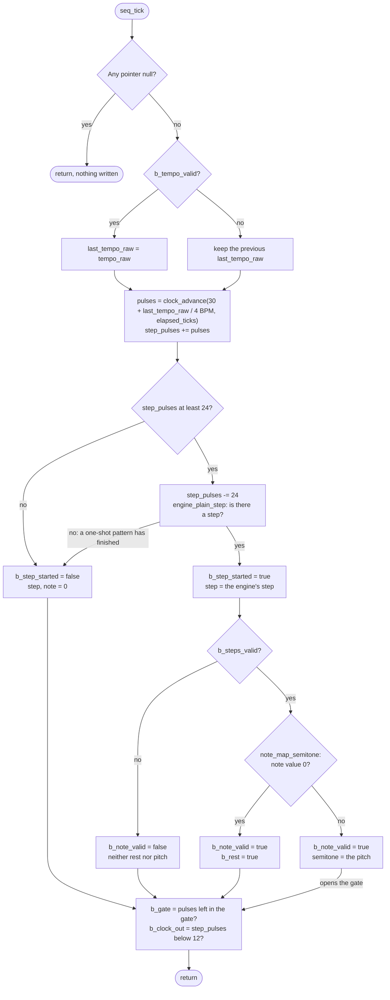

The chart leaves out reset: when `b_reset` is set, the engine is sent back to the start of its pattern before the clock is advanced, on every tick, and that has no output of its own. It also draws the gate loosely: every step that falls due ends the gate before it, and only the pitch branch opens a new one.

### The plain engine and the engine interface

An engine decides what each step of the pattern is. The sequencer owns the clock and says when a step is due; the engine says which step it is and what note value it holds. Every engine is to have a state type, an init function that doubles as its reset, and a step function taking the same `engine_inputs_t` (the panel bits and the addressing controls) and filling in the same `engine_step_t` (a step number and a note value). `core/engine.h` holds those two types and describes the pattern.

`engine_plain` is the first and simplest: it asks the addressing for the next step and reads that step's four switches as the note value. Its state is the addressing state and nothing else. `seq.c` calls it directly; a selector between engines belongs with the second engine.

### Addressing

`address_next()` gives the step to play and moves on. The controls are a direction, a first and a last step, and a one-shot flag:

- **The range** is the steps from the first to the last. If the first is the higher of the two, the range runs through step 15 and round to step 0 (first 14, last 1 is steps 14, 15, 0, 1), so every pair of settings is a valid range of 1 to 16 steps.
- **A cycle** is one pass over the range: first to last going forward, last to first in reverse, and out and back as a pendulum with each end played once (0 1 2 3 2 1, then 0 again).
- **One-shot** stops after one cycle; `address_next()` then returns false until `address_init()` (the reset) or until one-shot is cleared.
- **The state** is how many steps of the cycle have been played, not a step number. That makes reset the same in every direction (the count goes to 0) and the end of a cycle one comparison. The cost is that a change of direction or range in the middle of a cycle carries the count over, so the pattern jumps to the matching point of the new cycle and does not turn round where it stands. A count beyond the end of a shortened cycle starts the cycle again.

Forward over the whole panel, which is what the firmware plays today, goes round like this:

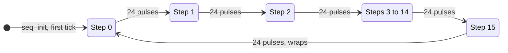

### The gate

The gate says how long a note is held. Its one control is a length in clock pulses, read when the step begins, so it scales with the tempo: 12 pulses is half a step at any speed.

- `gate_begin()` marks a step boundary. It ends whatever gate was open, and if a note begins there it opens a new one of that length.
- `gate_advance()` takes the pulses that have passed and gives the level: open until as many pulses as the length have gone by.

The sequencer calls both on a tick that begins a step, in that order, and looks at the level only afterwards. That is where ties come from, with no special case: a gate of a whole step (24 pulses) would close on the very pulse the next step begins on, and the next note has already reopened it by the time the level is read. So a length of 24 or more runs consecutive notes into one long gate, a rest in between still ends it, and anything shorter closes for at least one pulse (2.2 ms at the fastest tempo) before the next note. A length of 0 never opens the gate.

When a step begins late, after a stall, its gate is counted from when the step was due, not from when it was noticed, so the note still ends on time; if the whole gate has already gone by, it does not open.

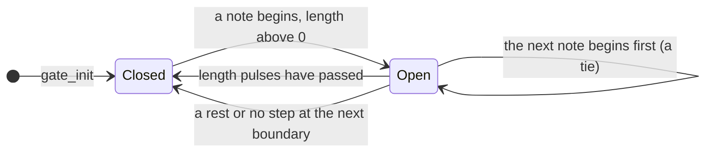

The length is one setting for the whole pattern, and the board has no control for it: the app fixes it at half a step. A tie or a gate length for a single step is a matter for the engines that give the second row of switches that meaning.

### The panel

`panel_step_value()` picks one step's four switches out of the raw bytes. The 64 bits are packed MSB first, 4 bits per step: step 0 is the high nibble of byte 0, step 1 the low nibble, step 2 the high nibble of byte 1, and so on. Every engine reads the same bits through this function and gives them its own meaning.

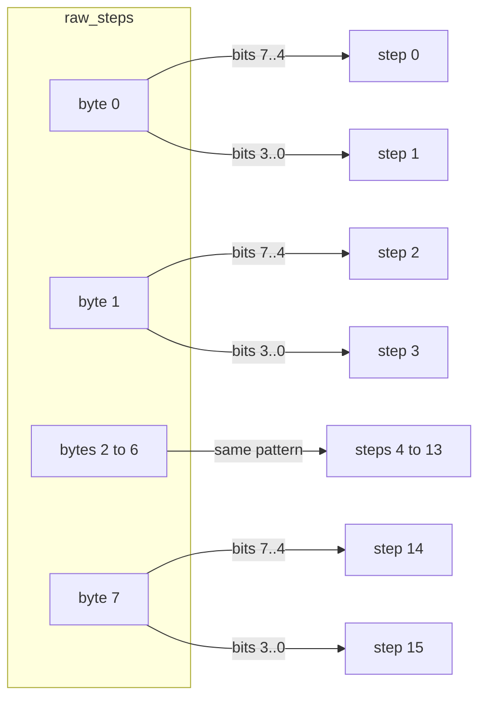

### Note mapping

`note_map_semitone()` turns a note value into a pitch. A value of 0 is a rest. Values 1 to 15 are the first fifteen notes of a scale, counting up from the root and carrying on into the next octaves: in a major scale 1 is the root, 8 the root an octave up, and 15 the root two octaves up. A pitch is a count of semitones above the lowest one the sequencer plays (note value 1 with a root of 0), from 0 to 45.

| Scale | Semitones above the root | Pitch of note values 1 to 15, root 0 |
|---|---|---|
| Chromatic | every one | 0 to 14 |
| Major | 0 2 4 5 7 9 11 | 0 to 24 |
| Natural minor | 0 2 3 5 7 8 10 | 0 to 24 |
| Major pentatonic | 0 2 4 7 9 | 0 to 33 |
| Minor pentatonic | 0 3 5 7 10 | 0 to 34 |

The root adds 0 to 11 semitones. There is no octave control yet: how many octaves are worth having depends on the DAC, which is not chosen. The scale tables are 51 bytes of constant data, which this toolchain keeps in RAM as well as flash; keeping them in flash only would take a compiler extension, which the core does not use.

## Target adapters — `adapters/target/`

### Register map — `atmega328p_regs.h` and `atmega328p_regs.ld`

Each register is declared as an ordinary variable, for example `extern volatile uint8_t PORTD;`, with no address in the C source. The linker places each name at its datasheet address using `atmega328p_regs.ld`, which the Makefile passes as an extra linker input. A register must appear in both files; one missing from the `.ld` file fails at link time with an undefined reference, but a wrong address there links silently.

The USART0 registers and their bit positions are declared in a second header, `atmega328p_usart_regs.h`, on the same scheme and with their addresses in the same `.ld` file. Only `serial_logger.c` includes it. The release build does not link that file, so with the bit positions in the main header they would be macros nothing in the release firmware uses (MISRA rule 2.5). The Timer/Counter2 registers have a header of their own in the same way, `atmega328p_timer2_regs.h`, which also names the interrupt vector and the attribute that makes a function its handler. The SPI registers are in `atmega328p_spi_regs.h`, included only by `spi.c`. The status register `SREG` is in the main header.

Registers in the low I/O range carry avr-gcc's `io_low` attribute, which lets the compiler keep using single-instruction bit operations (`sbi`, `cbi`, `sbis`) even though it cannot see the address. The generated code is identical to the earlier pointer-cast form. `ADC` is a 16-bit variable at 0x78, which reads ADCL then ADCH.

### Pin and ADC setup — `register_init.c`

| Pin | Nano label | Direction | Used for |
|---|---|---|---|
| PB1 | D9 | output, idle high | 74HC165 SH/LD (load, active low) |
| PB2 | D10 (SS) | output, held high | Nothing wired. It must not be a low input, or the SPI leaves master mode. Set by `spi.c` |
| PB3 | D11 (MOSI) | input (as at reset) | Nothing yet; the firmware sends zeros that nothing receives |
| PB4 | D12 (MISO) | input | 74HC165 serial data (QH of nearest chip), through 1 kΩ |
| PB5 | D13 (SCK, on-board LED) | output | 74HC165 CLK. Set by `spi.c`. The LED glows faintly during reads |
| PC0 | A0 | input | Nothing yet; never read |
| PC1 | A1 | output | Nothing yet; never written |
| PD2, PD3 | D2, D3 | input (as at reset) | Free. The chain was on these and PD4 until it moved to the SPI bus |
| PD4 | D4 | output, idle low | Gate output: high while a note is held |
| PD5 | D5 | output, idle low | Clock output: high for the first half of each step |
| ADC6 | A6 | analog | Tempo pot |

`register_init.c` sets PC0, PC1, the load line and the two outputs on port D. The load line is set high before it is made an output, so it is never driven low on the way; the gate and clock outputs are set low first for the same reason. The SPI driver sets its own two pins.

The 1 kΩ in the MISO line is there because PB3 to PB5 are also the pins an ISP programmer uses: it lets the programmer win against the chain's output. It is not needed for the serial bootloader.

The ADC is enabled with a prescaler of 128, giving a 125 kHz ADC clock from 16 MHz. A normal conversion takes 13 ADC clocks, about 104 µs.

### Tempo input — `analog_reader.c`

Writes `ADMUX` with AVcc as the reference and channel 6, sets `ADSC` to start a single conversion, polls until the hardware clears `ADSC`, then copies out the 10-bit result. The wait is bounded: after 10000 polls (a few milliseconds, against a worst-case conversion of about 200 µs) it returns `ERR_TIMEOUT`.


### SPI bus — `spi.c`

The first of the peripheral drivers: code that runs a part of the MCU for the device adapters above it and implements no port itself. Its header, `spi.h`, is private to `adapters/target/`.

`spi_init()` sets PB2 (SS) high and then makes it an output, makes PB5 (SCK) an output, and switches the SPI on as master: mode 0 (clock idle low, data sampled on the rising edge), most significant bit first, system clock divided by 16, which is 1 MHz. It writes both control registers in full, so nothing a bootloader left behind survives. The order matters: SS is an output before master mode is selected, because a low level on SS as an input cancels master mode.

`spi_transfer(tx, p_rx)` writes one byte to the data register, which starts eight clocks, polls for the transfer-complete flag, and reads back the byte that came in. A transfer takes 8 µs. The wait is bounded at 255 polls, well over ten times that, after which it returns `ERR_TIMEOUT`; that can only happen if the SPI is not enabled as master.

### Step input — `shift_reg_reader.c`

Pulses PB1 low then high to latch all parallel inputs, then makes one SPI transfer per byte, sending zeros. A 74HC165 has its first bit on QH as soon as it is loaded and moves to the next on each rising clock edge. SPI mode 0 samples on that same rising edge, so it takes each bit just before the chain moves on, and eight clocks leave the next byte's first bit waiting. Bits arrive MSB first, which fixes the wiring-to-step mapping:

| | Bits 7..4 | Bits 3..0 |
|---|---|---|
| 74HC165 inputs | H G F E | D C B A |
| Chip `k` (0 = nearest the MCU) | step `2k` | step `2k + 1` |

Within each nibble the higher-lettered input is the more significant bit, so input H of the nearest chip is the MSB of step 0. Each chip's Clock Inhibit pin must be tied to GND. The load pulse is a single `cbi`/`sbi` pair, about 125 ns wide at 16 MHz, comfortably above the 74HC165's minimum at 5 V; the clock is 1 MHz, far below the chip's limit.

The bytes are read into a buffer inside the function and copied out only if every transfer succeeded, so a read that fails part way leaves the caller's data as it was.

Sampling on the edge that also shifts relies on the chain's output not changing until a little after the edge. That is how a 74HC165 is normally read over SPI, and the MCU samples at the instant it drives the clock, but it is a timing margin the emulator cannot show: it has to be confirmed on the board (open item 8).

The chain, with data moving right to left towards the MCU. Chip 0's bits arrive first and land in byte 0:

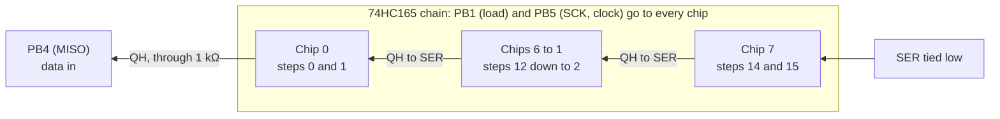

One read, as the pulses the MCU sends and the bits it gets back. The SPI hardware does the inner loop; the code sees one transfer per byte:

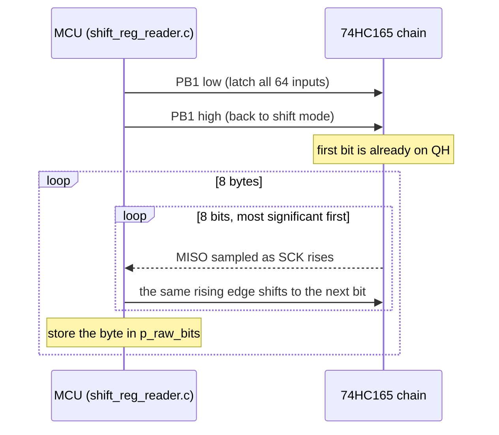

### Gate and clock outputs — `gate_output.c`, `clock_output.c`

Each is one function that drives one pin of port D high or low: `gate_output_write()` PD4 and `clock_output_write()` PD5. Either level is a single `sbi` or `cbi` instruction, so nothing else on the port is disturbed and nothing needs masking. The app calls both on every tick with the level the pin should have; writing the level a pin already has does nothing. The pins are made outputs, low, by `register_init.c`.

These are bare logic pins, 0 V and 5 V, good for about 20 mA. That is enough for a logic analyser or an LED through a resistor, and many gate inputs will take it, but nothing protects the pin from what is plugged into it. The roadmap's buffer stage goes between these pins and the jacks.

### Log — `serial_logger.c` (debug build)

`logger_init()` sets the baud divisor from `F_CPU` for 115200 baud in double-speed mode (`16000000 / (8 × 115200) − 1 = 16.4`, rounded to the nearest divisor, 16), sets double speed and 8N1 explicitly, enables the transmitter and receiver, and empties the queue. Nothing reads from the UART.

A divisor of 16 gives 117647 baud, 2.1 % fast. That is the usual setting for 115200 on a 16 MHz AVR and what USB serial bridges are routinely run at, but it is not exact. Normal-speed mode cannot do better (its nearest divisor is 8.5 % off), which is why double speed is used. The rates that are exact at 16 MHz are 250000, 500000 and 1000000; changing `BAUD` in `serial_logger.c` is enough to switch, and the divisor follows from it.

Nothing in the logger waits for the UART. The port functions `log_step_note()`, `log_step_rest()` and `log_error()` own the message wording (`Step 3 Note = 11`, where the number is the pitch in semitones, and `Step 5 Rest`). Each checks the log level, then writes the message in pieces, fixed text through `write_text()` and numbers through `write_decimal()` (unpadded decimal digits), into a 128-byte ring queue. `log_poll()`, called on every pass of the main loop, sends one queued byte if the transmit buffer is empty and otherwise returns at once. The level is set to DEBUG at init, so step notes (DEBUG) and errors (ERROR) both print.

A message that does not fit in what is left of the queue is dropped whole: the bytes of it already queued are taken back out, so a partial line is never sent. The queue holds the two longest messages together (53 characters each). In normal running it never fills: the fastest tempo produces a 19-character line every 52.6 ms, and a line is gone in 1.6 ms.

`log_flush()` sends everything still queued and does wait. It is only used when initialization has failed and the main loop is not going to run.

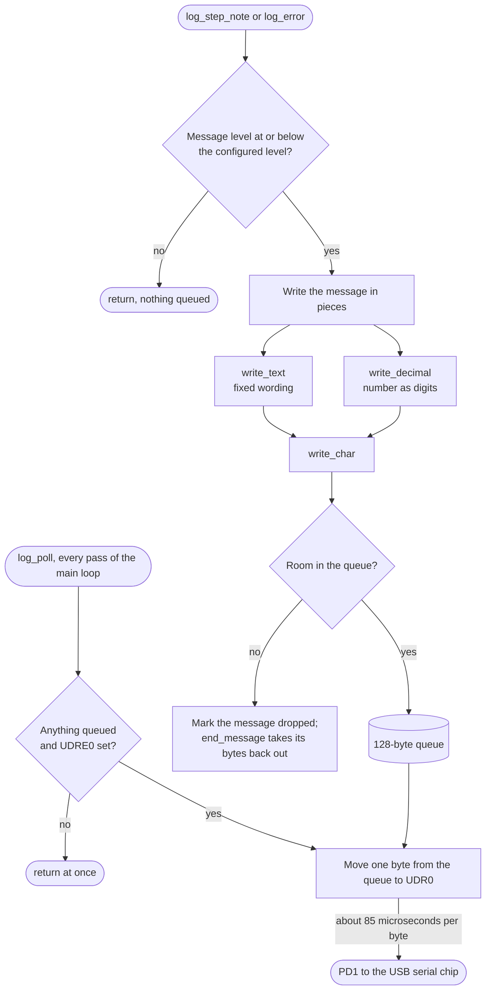

### Log — `null_logger.c` (release build)

The same six functions (`logger_init()`, `log_step_note()`, `log_step_rest()`, `log_error()`, `log_poll()`, `log_flush()`) with empty bodies. It touches no registers, so the USART is never set up or enabled, and it keeps no state. The app still calls the log port; each call returns immediately.

### Timebase — `timebase.c`

`timebase_init()` sets Timer/Counter2 to count the system clock divided by 64 (250 kHz) and to start again from zero after 250 counts (clear-on-compare mode, compare value 249), which is exactly 1000 times a second. It enables the compare match A interrupt, then sets the global interrupt enable bit in the status register. It is the last step of `platform_init()`, so interrupts are only on once everything else is set up.

The interrupt handler adds one to a single-byte counter, `g_tick_count`, and returns: 10 instructions including saving and restoring the one register it uses. It is the only code that runs outside the main loop, and it never touches the core or a port.

`timebase_elapsed_ticks()` reads the counter, subtracts what it read last time, and remembers the new value. The counter is one byte, so the read is a single instruction and cannot be interrupted half way; no masking is needed. Because the result is a difference, a pass that arrives late is told how many ticks it missed, up to 255, and none are lost. The counter wrapping from 255 to 0 does not disturb the subtraction.

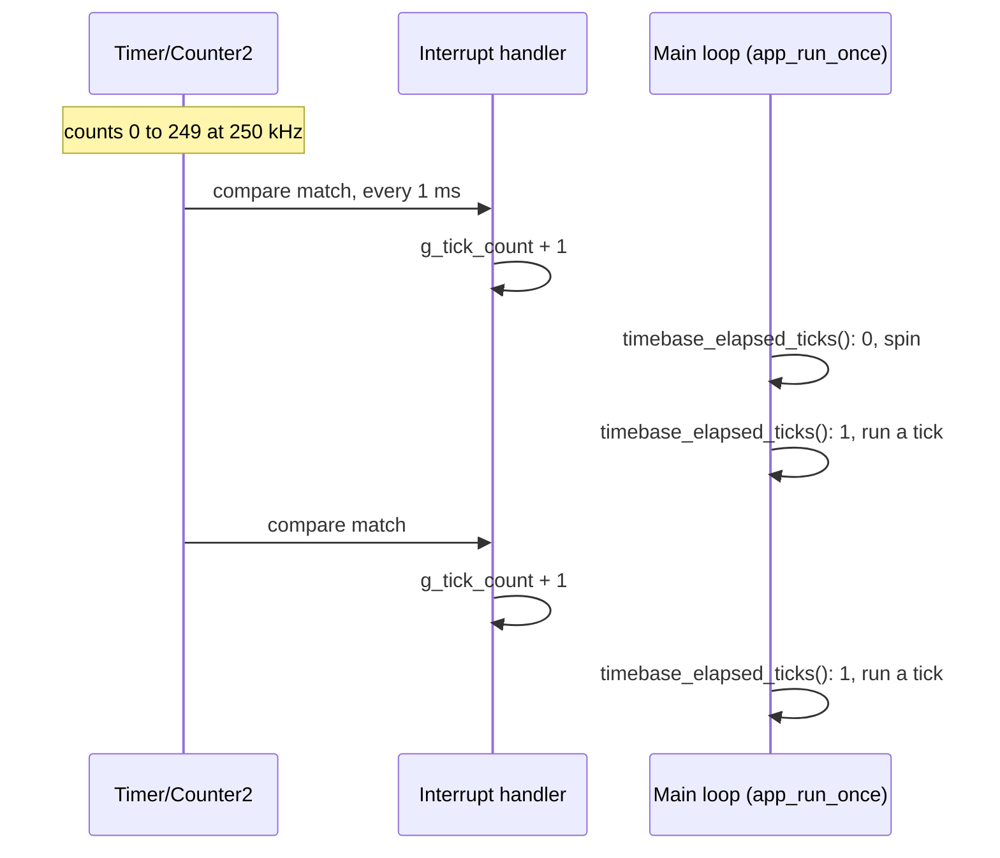

## Host side — `adapters/host/` and `tests/`

`adapters/host/host_ports.c` implements every port for the PC. Tests script what the input ports return (data and status) and read back a record of every log call in order. The gate and the clock output are written on every tick, so they are not in that record: the fake keeps each one's level and counts its rising edges, and notes how long the record was when the gate last rose. `make test` builds and runs nineteen programs with the PC compiler under `-std=c99 -pedantic -Wconversion -Wshadow -Werror`.

Eight link the code they test:

- `test_clock`: the clock alone. Exactly BPM × 96 pulses in a minute across the tempo range, no drift over ten minutes, the same count whether ticks arrive singly or in batches, the remainder carried between pulses, the 300 BPM limit, a tempo of 0, and null-pointer handling.
- `test_panel`: every step and nibble decodes from the right bits, a step number beyond the panel wraps, and a null buffer reads as 0.
- `test_address`: each direction over the whole panel and over a range, pendulum cycles of 30, 2 and 1 steps, a range that runs round through step 0, one-shot in every direction, reset, clearing and setting one-shot mid-cycle, a direction or range changed mid-cycle, out-of-range settings, and null-pointer handling.
- `test_note_map`: the rest, the pitch of all fifteen note values in each of the five scales, every root in every scale, the highest pitch, out-of-range notes, roots and scales, and null-pointer handling.
- `test_engine_plain`: steps in addressing order with their panel values, the panel read as it is when the step is asked for, a finished one-shot giving no step, reset, and null-pointer handling (the pattern does not move on).
- `test_gate`: the gate alone. Closed after init; open for exactly its length for a range of lengths; a length of 0; a rest; several pulses at once and more than were left; a shorter gate closing before the next note; a whole step tying three notes with the gate never seen closed; a longer length cut off by the next boundary, and a rest ending a tied note; the length read when the note begins; and null-pointer handling.
- `test_seq`: the sequencer with the modules above linked in. The first tick begins step 0; step length for five tempos (exactly 15000 / BPM ticks, with the first step a tick short); 19 steps a second at the fastest setting; the steps in order with wrap; the pitch or rest of every step and nibble; the note taken from the tick its step begins on; a step beginning on time through a failed read; the tempo floor before any reading; last-valid-tempo reuse; independence of the two valid flags; batched ticks; steps owed after a stall; a rest; the scale and root applied; the addressing controls followed; a one-shot pattern stopping while the clock runs on; reset not moving the clock, held, and restarting a finished one-shot; the gate open for half of each of sixteen steps, to the tick; four other gate lengths; no gate for a rest or an unreadable step; tied notes and the rest that ends them; the gate length read when the step begins; a late step's gate counted from when it was due; the clock output high for the first half of every step, with or without a note, and through a finished one-shot; a reset not cutting a held note; and null-pointer handling.
- `test_app`: the real `app.c` and core linked against the fakes, with time scripted. Checks that a pass with no tick only polls the log; that a step is logged one tick after it begins, once; that steps are logged at the tempo and wrap; that the gate and clock output go high one tick after their step begins and before its log line; that they are written on every tick and not between ticks; that the gate is held for half a step; that a rest has a clock pulse and no gate, and an unreadable step no gate; that re-initializing puts both low; that a rest is logged as a rest; that all sixteen steps play forward in the chromatic scale; that the inputs are read on the first tick and every eighth after, counted in elapsed ticks; that a failed read logs the right error in the right place, once per step; and that init failure is logged, flushed and returned.

The other eleven `#include` the one source file they test, with `tests/fake_atmega328p_regs.h` standing in for the register map (it claims the include guards of all four real register headers) and any function that file calls but does not define supplied as a stub by the test:

- `test_serial_logger`: the USART setup values (divisor 16, double speed, 8N1), the level filter, that nothing is sent until polled, one byte per poll, nothing while the transmit buffer is full, message order, a message that does not fit being dropped whole, the queue wrapping, `log_flush()`, and that every message is byte-for-byte what a `printf`-style format string produces.
- `test_null_logger`: init succeeds at any level, every message is discarded, polling and flushing do nothing, and no USART register is written.
- `test_register_init`: which direction bits are set and cleared, that the UART's pins keep their direction, that the load line idles high and was high before it became an output, that the gate and clock pins start low and were low before they became outputs, that other levels are left alone, and the ADC enable and prescaler value.
- `test_gate_output` and `test_clock_output`: high sets the one pin and low clears it, whatever the rest of port D holds, and no direction register or other port is touched.
- `test_analog_reader`: channel and reference selection, the result, a slow conversion, the timeout at exactly the poll budget, and parameter checks. The fake ADC clears its start bit after a set number of polls.
- `test_spi`: the control register values (master, mode 0, 1 MHz) with stale bits cleared, the pin directions and levels, SS high before it is an output and an output before master mode, bytes sent and received, the complete flag cleared, a slow transfer, the timeout at exactly the poll budget and with the SPI never enabled, and the null check. The fake SPI completes a transfer after a set number of polls, and only if it is enabled as master.
- `test_shift_reg_reader`: every bit of the chain lands in the right place, one load pulse before the first clock and one transfer per byte, the load line left idle, other port B pins and all of port D untouched, a failed transfer at each position returned with the caller's buffer left alone, and parameter checks. The SPI driver is a stub that clocks the fake's model of the 74HC165 chain, so a read only returns the right bytes if the load pulse comes first and the line is high while it reads.
- `test_init`: logger bring-up, then registers, then the SPI bus, then the timebase; at DEBUG level; each failure returned, and the timebase (and so interrupts) not started after one.
- `test_timebase`: the Timer/Counter2 register values, that interrupts are enabled only after the timer is fully set up and without disturbing the other status bits, one tick per interrupt, ticks reported once, a late caller losing none up to 255, and the counter wrap. The fake header turns the interrupt handler into an ordinary function, which the test calls to make a tick happen.
- `test_main`: `main()` (renamed while included) returns the status when init fails and otherwise loops calling `app_run_once`. The stub leaves the endless loop with `longjmp`.

Which program tests which source file. Solid arrows link the real file; dotted arrows `#include` it against the fake registers. Each core program is linked with all of `core/`, so `test_seq` runs the real engine, addressing and note mapping under the sequencer:

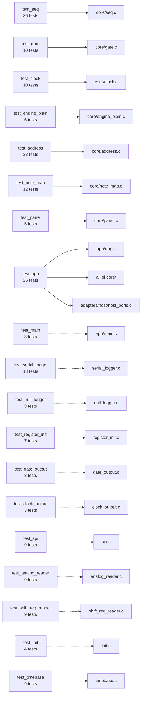

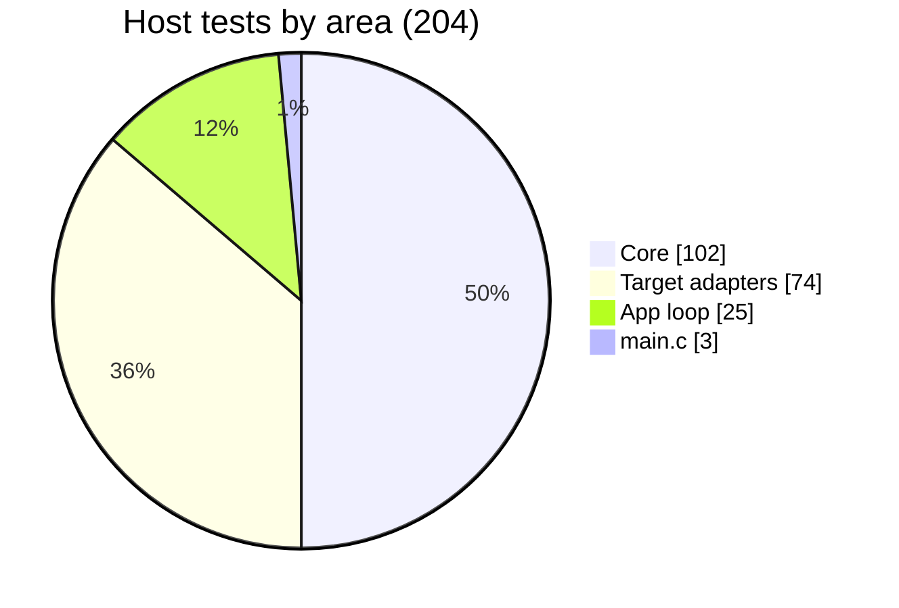

### Coverage

`make coverage` rebuilds the same programs with `--coverage -O0` into `build/coverage/`, runs them, and has `tools/coverage/report.py` add up gcov's counts per source line across all the programs. It fails unless every `.c` file in `core/`, `app/` and `adapters/target/` has every line executed and every branch taken at least once; a firmware file no test compiles counts as a failure. `adapters/host/host_ports.c` is test support: its figures are printed (98% of lines, 81% of branches) but not enforced, and the tests themselves are not measured.

What this does not show: the fakes are plain variables, so nothing here checks a register's address, the `sbi`/`cbi` instructions the pulses rely on, that the interrupt vector reaches its handler, real timing, or what the hardware does in response. The emulated board below covers the first four; the last still needs the board.

## Emulated board — `tools/sim/`

`make sim` builds both configurations and runs each `output.hex`, exactly as it would be flashed, on an emulated ATmega328P. The emulator is the [avr8js](https://github.com/wokwi/avr8js) library (version pinned in `tools/sim/package-lock.json`), run under Node with its built-in test runner. Time is counted in CPU cycles at 16 MHz, so every run gives the same result.

| Folder | Holds | Knows about the sequencer |
|---|---|---|
| `lib/` | `machine.js`: loads the HEX file and builds the chip (CPU, ports B to D, ADC, USART0, Timer/Counter2, SPI). `pin_recorder.js`: every change of level on one pin, with its cycle, as edges and as pulses | No |
| `parts/` | `hc165.js`: a 74HC165 chain, its load line a wire and its clock and data taken a byte at a time from the SPI | No |
| `boards/` | `nano_sequencer.js`: which part is on which pin, the panel switches, the tempo pot, recorders on the gate and clock pins, serial capture | Yes |
| `scenarios/` | `debug.test.js`, `release.test.js`: what each image must do | Yes |

The first two folders are kept free of anything specific to this project so they can be lifted out for another one.

Nineteen scenarios run. For the debug image: every log line matches the switches set on the emulated panel across two passes of the pattern, as a pitch one below the note value or as a rest where all four switches are off; the USART is set to 115200 baud in double-speed mode; the panel is read every 8 ms with 64 clock pulses; a switch changed mid-pattern is heard the next time its step plays; a step lasts 100 ms at 150 BPM, with no drift over 16 steps; a step lasts 500 ms with the pot at zero; every step with a note has a gate that rose before its log line began, in the same tick, and the rest has none; the gate and clock output keep time to within 0.02 ms while the log is being sent; and the first step is logged within 3 ms of reset. For the release image: the USART is never enabled, nothing is sent and PD0 and PD1 are left as inputs; PD4 and PD5 are the only outputs on port D; the clock output pulses once per step at 150 BPM, 100 ms apart and 50 ms high to within 0.02 ms, with no drift over 16 steps; the gate rises with the clock output of every step that has a note, just ahead of it, stays high 50 ms, and is absent for the rest; the first gate opens on the second tick; Timer/Counter2 holds the 1 kHz settings and interrupts are enabled; the SPI runs as master in mode 0, MSB first, at 1 MHz, with SS and the load line idle high; a read is eight transfers of zeros; the panel is read every 8 ms, to within 0.01 ms, with 64 clock pulses; and the first read is on the first tick.

The release image has no log, so until the gate there was nothing outside the chip to show when a step began in that build. Now its step timing is measured directly, on the same pins as the debug build's, and the two agree.

The figures the emulator gave are in "The main loop and one tick" above.

What this does not show: the chip and the parts are models. The 74HC165 model follows the datasheet's logic (the load input is level-sensitive) but has no setup, hold or pulse-width limits, nothing analog is modelled, and only the GPIO, ADC, USART, Timer/Counter2 and SPI parts of avr8js have been exercised. The gate and clock pins are recorded as logic levels at the instant the port register is written: nothing is said about voltage, rise time or what a load does to them. The emulated SPI does not move its pins: it hands the board whole bytes, and the 74HC165 model answers with eight bits sampled before each shift. So the scenarios show that the firmware asked for mode 0 and made the right transfers after a load pulse, but not that mode 0 reads a real chain correctly. The emulated clock is exact; the board's 16 MHz resonator is not, and one tick period should be compared against the board. `make sim` is not part of the coverage figure.

## Build — `Makefile`

`make` compiles every `.c` under `app/`, `core/` and `adapters/target/` (less the logger the configuration does not use) into `build/obj/`, links `build/<config>/output.elf`, converts to Intel HEX, and prints a size report. `make flash` uploads with avrdude at 57600 baud (the old-bootloader Nano setting), with the signature check and verification on. `make test`, `make coverage`, `make misra` and `make sim` are described above and in the README. `make check` runs both builds and those four through `tools/check/run.py`, which prints one line per stage and the full output only of a stage that fails. The Makefile handles Windows, macOS and Linux; only Windows has been exercised.

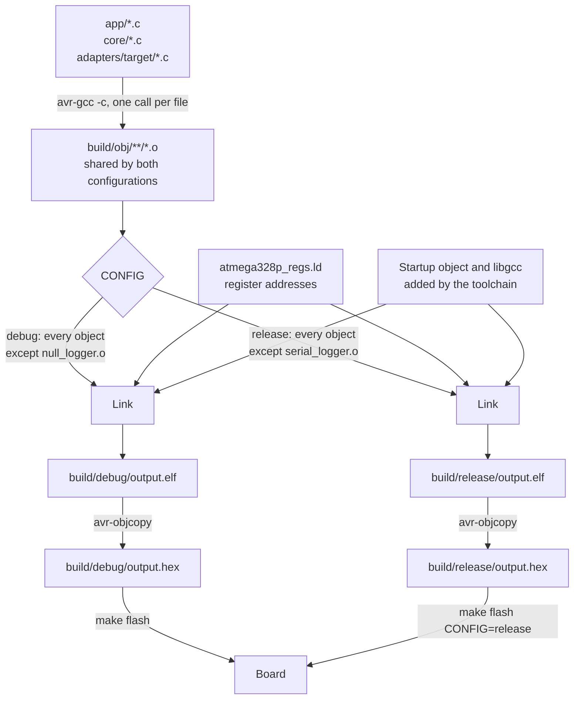

### Build configurations

`CONFIG=debug` (the default) and `CONFIG=release` differ in one thing: which of `serial_logger.c` and `null_logger.c` is linked. There are no configuration macros and no conditional compilation; every source file is compiled the same way for both, so the two share `build/obj/`. Each has its own output folder (`build/debug/`, `build/release/`), so switching back and forth cannot leave a stale image. `make flash CONFIG=release` uploads the release image. `make test`, `make coverage` and `make misra` do not take a configuration: they always cover both loggers.

| | Debug | Release |
|---|---:|---:|
| Flash | 2930 bytes | 2196 bytes |
| Static RAM | 386 bytes | 98 bytes |
| Step timing | From the timer tick | The same |

A lower baud rate for release was considered and has no use: the release build never switches the USART on, so it has no baud rate.

### Where the flash goes

Sizes of the linked functions and data, from `avr-nm --size-sort` on each `output.elf`, grouped by source. The debug build:

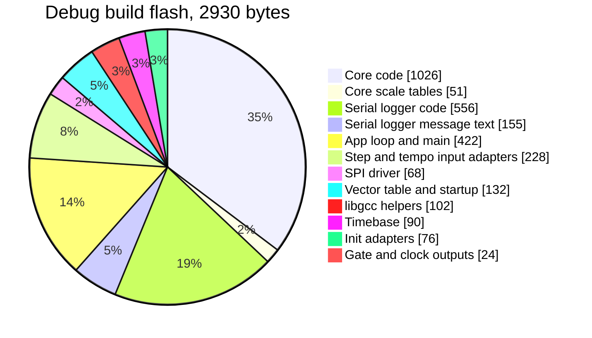

| Part | Debug | Release |
|---|---:|---:|
| Core (code and scale tables) | 1077 | 1078 |
| Logger (code and message text) | 711 | 16 |
| App loop and `main` | 422 | 422 |
| Step and tempo input adapters | 228 | 228 |
| Vector table and startup code | 132 | 132 |
| SPI driver | 68 | 68 |
| libgcc helpers | 102 | 62 |
| Timebase (setup, interrupt handler, tick count) | 90 | 90 |
| Init adapters | 76 | 76 |
| Gate and clock outputs | 24 | 24 |
| **Total** | **2930** | **2196** |

Within the core: the sequencer 416 bytes, addressing 178, the plain engine 124, note mapping 106 plus its 51 bytes of tables (52 in the release build, with a byte of padding), the clock 84, the gate 68 and the panel 50.

The core is the largest part of either image, and the serial logger is about a quarter of the debug one. The release build sheds one libgcc helper that only the logger needs, the 16-bit divide used to print decimal numbers. Both builds carry the 8-bit divide (note mapping divides by the length of the scale) and the routine that copies initialised data into RAM at startup, which the release build did without until it had the scale tables. The debug build uses 9.5 % and the release build 7.1 % of the 30720 bytes available below the old bootloader.

Moving the shift registers to the SPI bus cost 162 bytes: the driver, and a step input adapter that grew from 64 to 158 bytes because it now reads into its own buffer and can fail part way.

The gate and the clock output cost 234 bytes in each build: 68 for the gate module, 100 more in the sequencer, 30 in the app, 24 for the two pin adapters and 12 to set the pins up.

Static RAM in the debug build is 386 bytes: the 128-byte log queue, 155 bytes of message text, the 51 bytes of scale tables, and 52 bytes of state. `avr-size` (and so `make` and `make check`) reports 180: this toolchain's `avr-size` counts constant data under flash only, although it is also copied to RAM. The release build is under-reported the same way now that it has the tables: 98 bytes used, 46 reported.

## Static analysis

`make misra` runs cppcheck with its MISRA addon three times, each time over the files that are linked together for that build: the debug firmware (`core/`, `ports/`, `app/`, `adapters/target/` without `null_logger.c`), the release firmware (the same without `serial_logger.c`) and the `test_app` host program (`core/`, `ports/`, `app/app.c`, `adapters/host/`, `tests/test_app.c`). Counts before the refactor are in [misra-baseline.md](misra-baseline.md): 165 findings, 5 of them mandatory and 101 required. There are now none. The source has one inline suppression, and it is a false positive rather than a real departure from the rule: rule 8.7 (advisory) on the timer interrupt handler in `timebase.c`. The handler is referenced from outside its file, by the jump in the startup object's vector table, so it must have external linkage; cppcheck analyses only the C source, never sees that reference, and reports the function as used in one file. It is recorded in the source in the deviation format so the reason sits beside the suppression.

Two things about scope: findings located in `tests/` are not reported, because test code is not held to the coding standard; the test file is in the host run only so cppcheck can see the host fakes being called. And cppcheck implements only part of MISRA C, so zero findings means zero from this tool, not a claim of full compliance. The `io_low` and `signal` attributes in the register headers are compiler extensions that the tool does not flag, and it did not object to the handler's reserved name (`__vector_7`).

How findings are handled is set out in [tools/misra/CLAUDE.md](../tools/misra/CLAUDE.md).

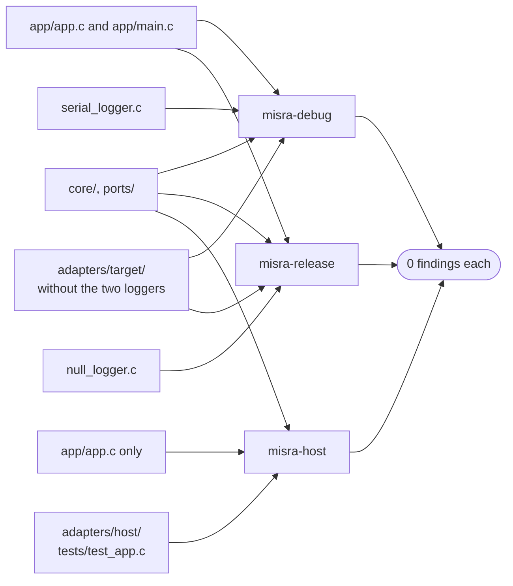

## Open items

Earlier findings from this analysis that have since been fixed are in the git history (log level filter, flash port default, header dependency tracking, register map, UART setup, robustness gaps, stale comments, Makefile flags, coding-standard cleanup of the target adapters). What remains:

### 1. Unused pins are configured

PC0 and PC1 are given a direction in `register_init.c` but never read or written. PD0, the USART receive pin, used to be set as an output there as well; that line was removed, because the release build never enables the receiver and would have driven the pin against the board's USB serial chip. PD0 and PD1 are now left as they are at reset (inputs) unless the serial logger takes them over.

### 2. No crash log

Nothing records a reset or an error across power cycles, and the release build has no logging at all. A persistent error log in EEPROM is wanted and there is ample space, but it waits until there is a watchdog and an output stage, so that it can record real resets.

### 3. The timer tick has not run on the board

The 1 kHz tick, the interrupt and the non-blocking loop have been checked on the host and on the emulated board only. One period should be measured on the real board, both because the emulator's timer model is new to this project and because the board's resonator sets the real tempo accuracy.

### 4. The first step after reset is one tick short

The first tick begins step 0 and also counts towards step 1, so step 0 lasts 1 ms less than the others, and so do its gate and its clock pulse (49 ms where the rest are 50 at 150 BPM). It is harmless for a free-running pattern and will want fixing when there is a run/stop control and a step can begin on an external event.

### 5. `make check` under-reports static RAM

For the debug build it prints 180 bytes where 386 are used, and for the release build 46 where 98 are used, for the reason given under "Where the flash goes".

### 6. The pattern controls have no hardware

Direction, first and last step, one-shot, reset, scale, root and gate length are inputs to the core and are tested there, but nothing on the board sets them. `app.c` fixes them in `set_fixed_controls()`, so on the board (and the emulated one) only the forward, looping, chromatic path with a half-step gate is ever taken, and nothing but the host tests exercises the rest, ties included. The roadmap gives them switches and pots in phases 6 and 7.

### 7. A change of direction or range mid-cycle jumps

The addressing counts steps played in the cycle, so reversing in the middle of a pattern jumps to the matching point of the reversed cycle; it does not turn round on the step it is on. Nothing can change these controls yet. If turning in place is wanted when they get hardware, it is a change inside `address.c` only.

### 8. The shift registers on the SPI bus have not run on the board

The board has to be rewired before this firmware reads its panel: load from D2 to D9 (PB1), clock from D3 to D13 (PB5), and data from D4 to D12 (PB4) through 1 kΩ. Until then the host tests and the emulated board are the only evidence. Two things in particular only the board can show: that SPI mode 0 samples each bit of a real chain correctly (see "Step input" above), and that the on-board LED on D13 loading the clock line does no harm at 1 MHz. If a bit comes back shifted by one place, the mode is the first thing to look at.

### 9. The gate and clock outputs have not run on the board, and have no buffer

PD4 and PD5 are driven straight from the MCU, 0 V and 5 V. On the emulated board their edges are on time to a few microseconds; on the real one nothing has been measured. A logic analyser or an LED and resistor on D4 and D5 is the check: at 150 BPM the clock should be a 10 Hz square wave and the gate the same wherever a step has a note. Do not patch them into other equipment until the buffer stage is built: the pins have no protection against a voltage fed back into them or a short.

Closed by the timebase work: the tempo range now has a floor (30 to 285 BPM), and the debug and release builds keep the same time, because the step period comes from the timer and not from a delay plus however long the rest of the loop took.

## What the output stage will need

- **Step advance**: done. The engine holds the position in the pattern; `seq_outputs_t` says when a step begins, which one, and its pitch or that it is a rest, and the app logs it.
- **A pitch to send and a rest to stay silent on**: done, as a semitone count from 0 to 45. Turning that into a DAC code is `pitch_cal`, still to come.
- **A usable tempo range**: done, 30 to 285 BPM.
- **A timing decision**: done. A 1 kHz timer tick, a loop that never blocks, and outputs applied at the tick boundary.
- **A gate and a clock output**: done, as logic levels on PD4 and PD5, applied first in the tick's apply step. They still need a buffer stage between the pins and the jacks.
- **A gate length**: done, as a number of clock pulses, fixed at half a step until it has a control.
- **An SPI bus** for an external DAC: done. The driver is in place and already reads the panel; a DAC needs MOSI made an output and a chip select.
- **A pitch CV output**: a `cv` port with a DAC adapter, written before the gate rises so the pitch has settled when the note starts. It waits on the choice of DAC.
